# Hybrid User Provisioning from Active Directory to Microsoft 365

## 📌 Project Overview

This lab demonstrates an end-to-end hybrid identity provisioning scenario in which new employee accounts are created in an on-premises Active Directory environment and synchronized to Microsoft Entra ID and Microsoft 365.

The objective was to simulate a real-world employee onboarding scenario and validate the identity across both on-premises and cloud environments.

---

## 🏢 Business Scenario

Two new employees are joining the Finance department.

The organization uses an on-premises Active Directory environment integrated with Microsoft Entra ID and Microsoft 365.

The new employees must:

- Have user accounts created in Active Directory
- Be placed within the appropriate Finance organizational structure
- Have relevant employee attributes configured
- Be synchronized to Microsoft Entra ID
- Be visible in Microsoft 365
- Receive the required Microsoft 365 license
- Be configured for Multi-Factor Authentication (MFA)

---

## 🎯 Lab Objectives

The objectives of this lab were to:

1. Create a Finance Organizational Unit (OU) in Active Directory.
2. Create new Finance employee accounts.
3. Configure employee attributes such as job title and manager.
4. Synchronize the identities from Active Directory to Microsoft Entra ID.
5. Trigger and validate directory synchronization.
6. Verify the synchronized users in Microsoft 365.
7. Assign the required Microsoft 365 licenses.
8. Configure MFA for the users.
9. Validate the completed hybrid identity provisioning process.

---

## 🏗️ Architecture

The identity flow used in this lab was:

On-Premises Active Directory  
↓  
Microsoft Entra Connect  
↓  
Microsoft Entra ID  
↓  
Microsoft 365 Services

Active Directory remained the source environment for the synchronized user identities.

---

## 🛠️ Technologies Used

- Windows Server
- Active Directory Domain Services (AD DS)
- Microsoft Entra Connect
- Microsoft Entra ID
- Microsoft 365 Admin Center
- Multi-Factor Authentication (MFA)
- PowerShell

---

# 🔧 Implementation

## Step 1 — Create the Finance Organizational Unit

A dedicated Finance OU was created in Active Directory to organize and manage Finance department identities.

This provides a logical administrative structure for department-based user management.

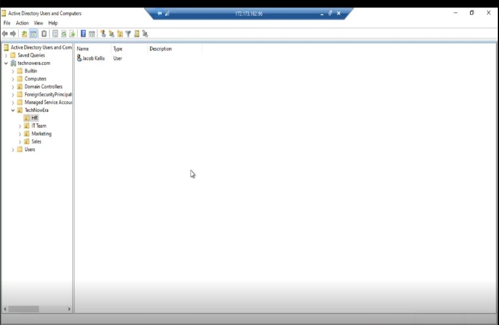

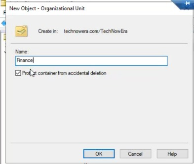

---

## Step 2 — Create Finance User Accounts

New employee accounts were created within the Finance OU in Active Directory.

The accounts represented newly joined employees requiring access to the organization's Microsoft 365 environment.

> 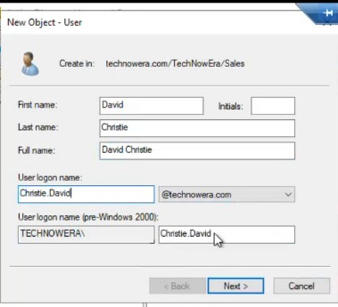

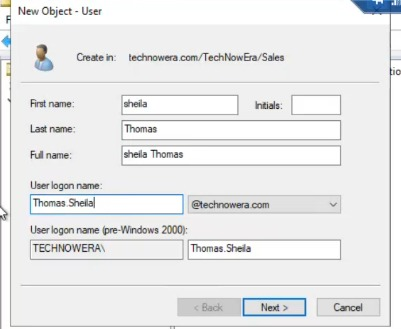

---

## Step 3 — Configure User Attributes

Relevant employee information was configured for the user accounts, including attributes such as:

- Department
- Job title
- Manager

Maintaining accurate identity attributes is important for administration, access management, automation, and identity lifecycle processes.

> 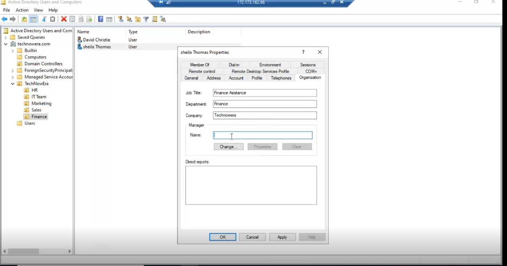

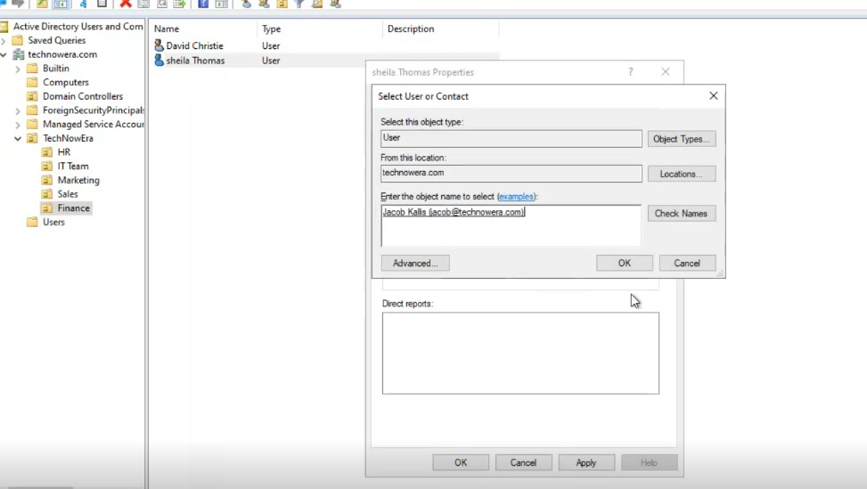

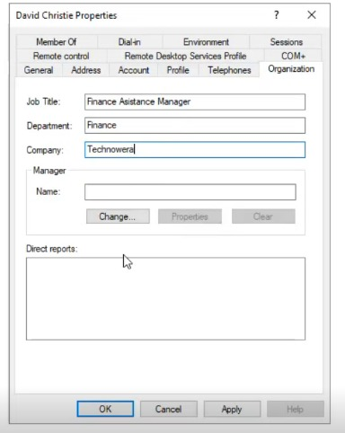

---

## Step 4 — Synchronize Identities to Microsoft Entra ID

After the on-premises identities were prepared, Microsoft Entra Connect was used to synchronize the identities with Microsoft Entra ID.

A delta synchronization was triggered to process the newly created and modified identity objects.

> 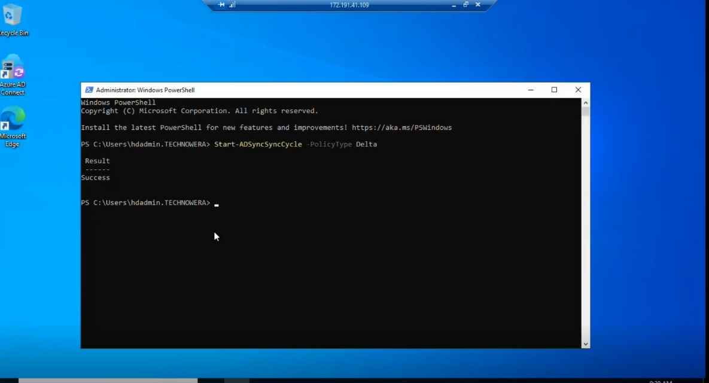

---

## Step 5 — Validate Synchronization

After synchronization completed, the cloud environment was checked to confirm that the new users were successfully synchronized.

Validation was performed through the Microsoft cloud administration portals.

> 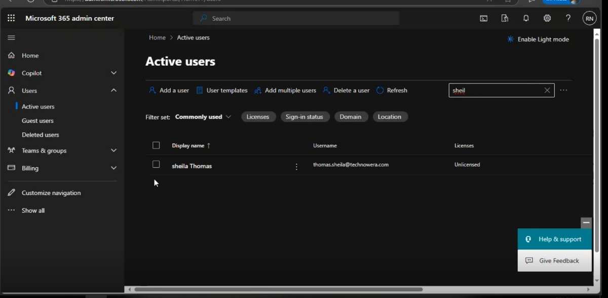

---

## Step 6 — Assign Microsoft 365 Licensing

The required Microsoft 365 license was assigned to the synchronized users so that they could access the appropriate Microsoft 365 services.

> 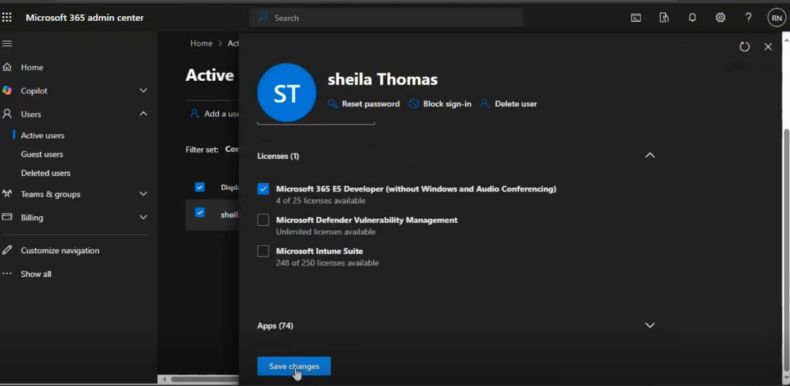

---

## Step 7 — Configure Multi-Factor Authentication

MFA was configured as part of securing access to the users' Microsoft 365 identities.

This provides an additional authentication factor beyond the user's password.

> 

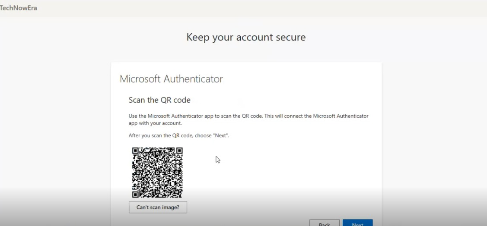

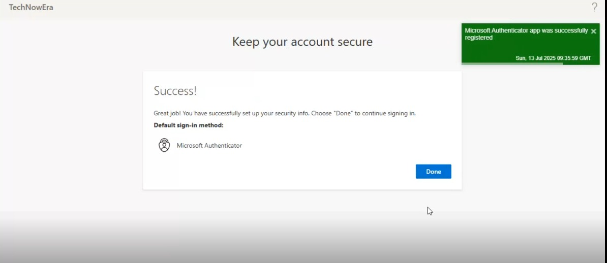

---

# ✅ Validation

The following items were validated after implementation:

- Finance OU successfully created
- New employee accounts created in Active Directory
- Employee attributes configured
- Users synchronized to Microsoft Entra ID
- Users visible in Microsoft 365
- Required licensing assigned
- MFA configuration completed

The lab successfully demonstrated the lifecycle of a hybrid user from on-premises identity creation through cloud synchronization and Microsoft 365 access configuration.

---

# 🧠 Skills Demonstrated

- Active Directory user administration
- Organizational Unit management
- User attribute administration
- Hybrid Identity
- Microsoft Entra Connect
- Directory synchronization
- Microsoft Entra ID
- Microsoft 365 Administration
- Microsoft 365 licensing
- Multi-Factor Authentication
- Identity provisioning
- Joiner lifecycle administration
- Hybrid identity validation

---

# 💡 Key Learning

This project strengthened my understanding of how organizations using hybrid identity environments can provision employees from on-premises Active Directory into Microsoft Entra ID and Microsoft 365.

It also demonstrated the importance of validating each stage of the identity lifecycle rather than assuming that successful account creation in Active Directory automatically means the cloud identity is ready for use.

---

## 🔒 Lab Environment

This project was completed in a personal/training lab environment.

All identities and configurations shown in this project are for learning and demonstration purposes only.
