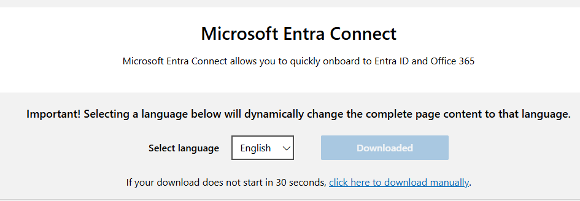
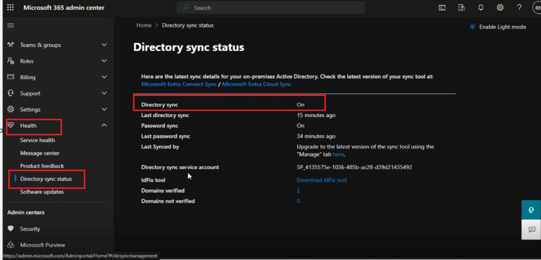
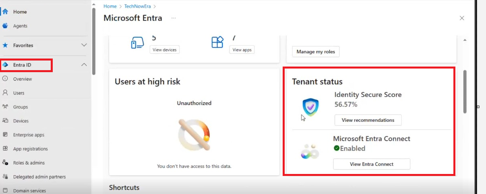

#Hybrid Directory Synchronization Monitoring and Validation with Microsoft Entra Connect

## 📌 Project Overview

This lab demonstrates the implementation, monitoring, and validation of hybrid directory synchronization between an on-premises Active Directory environment and Microsoft Entra ID.

Microsoft Entra Connect was used to synchronize on-premises identities with Microsoft 365. The synchronization status was then monitored and validated using the Microsoft 365 Admin Center and Microsoft Entra Admin Center.

The objective was to simulate a real-world hybrid identity administration scenario where an administrator must ensure that directory synchronization is operating successfully and identify potential synchronization issues.

---

## 🏢 Business Scenario

An organization maintains its user identities in an on-premises Active Directory environment while providing users with Microsoft 365 cloud services.

To maintain a consistent identity across both environments, the organization requires its Active Directory identities to synchronize with Microsoft Entra ID.

As the administrator, the task is to:

- Prepare the on-premises Active Directory environment for synchronization
- Configure Microsoft Entra Connect
- Define the required synchronization scope
- Enable Password Hash Synchronization
- Monitor directory synchronization
- Verify synchronization health and status
- Validate Microsoft Entra Connect from the Microsoft Entra Admin Center

---

## 🎯 Lab Objectives

The objectives of this lab were to:

1. Prepare the on-premises Active Directory environment.
2. Configure Microsoft Entra Connect.
3. Configure the required Organizational Unit (OU) synchronization scope.
4. Enable Password Hash Synchronization.
5. Synchronize identities from Active Directory to Microsoft Entra ID.
6. Monitor directory synchronization from the Microsoft 365 Admin Center.
7. Review synchronization status and identify synchronization errors.
8. Validate Microsoft Entra Connect status through the Microsoft Entra Admin Center.

---

## 🏗️ Architecture

The hybrid identity flow demonstrated in this lab is:

**On-Premises Active Directory**  
↓  
**Microsoft Entra Connect**  
↓  
**Microsoft Entra ID**  
↓  
**Microsoft 365**

Microsoft Entra Connect provides the synchronization layer between the organization's on-premises identity environment and Microsoft cloud identity services.

---

# 🔧 Implementation

## Step 1 — Prepare the On-Premises Active Directory Environment

The on-premises Active Directory environment was reviewed and prepared before configuring directory synchronization.

The required users and Organizational Units were verified to ensure that the appropriate identities were available for synchronization.

---

## Step 2 — Configure Microsoft Entra Connect

Microsoft Entra Connect was configured to establish synchronization between the on-premises Active Directory environment and Microsoft Entra ID.

The appropriate Organizational Unit synchronization scope was selected so that only the required identities would be included in the synchronization process.

Password Hash Synchronization was also enabled as part of the hybrid identity configuration.

---

## Step 3 — Monitor Directory Synchronization in Microsoft 365

After configuring synchronization, the Microsoft 365 Admin Center was used to monitor the directory synchronization status.

The **Health → Directory sync status** area was reviewed to verify the synchronization state.

The following areas were checked:

- Directory synchronization status
- Latest synchronization
- Synchronization health
- Synchronization errors

This provides administrators with visibility into whether identities are successfully synchronizing between the on-premises and cloud environments.

---

## Step 4 — Validate Microsoft Entra Connect

The Microsoft Entra Admin Center was used to further validate the Microsoft Entra Connect configuration.

The synchronization information was reviewed to confirm that the hybrid identity connection between Active Directory and Microsoft Entra ID was operational.

This validation provides an additional administrative view for monitoring the organization's hybrid identity environment.

---

## ✅ Validation Results

The lab demonstrated the process of configuring and validating directory synchronization between Active Directory and Microsoft Entra ID.

The validation process included:

- Reviewing the Microsoft Entra Connect configuration
- Confirming the synchronization scope
- Verifying Password Hash Synchronization configuration
- Monitoring directory synchronization from Microsoft 365
- Reviewing synchronization status
- Checking for synchronization errors
- Validating Microsoft Entra Connect through the Microsoft Entra Admin Center

---

## 🛠️ Skills Demonstrated

- Active Directory
- Microsoft Entra ID
- Microsoft Entra Connect
- Hybrid Identity
- Directory Synchronization
- Password Hash Synchronization
- Organizational Unit (OU) synchronization scope
- Microsoft 365 Administration
- Microsoft Entra Administration
- Directory synchronization monitoring
- Hybrid identity validation
- Identity lifecycle administration

---

## 💡 Key Learning

This project strengthened my understanding of how organizations maintain a consistent identity between on-premises Active Directory and Microsoft Entra ID.

It also demonstrated that implementing synchronization is only one part of hybrid identity administration. Administrators must continuously validate synchronization health, review synchronization status, and investigate errors to ensure identities remain consistent across on-premises and cloud environments.

---

## 🔒 Lab Environment

This project was completed in a personal/training lab environment.

All identities, configurations, and screenshots included in this project are used for learning and skills demonstration purposes only. No confidential employer or customer information is included.
