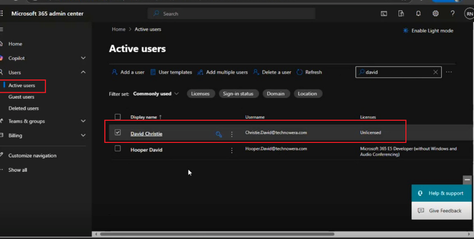
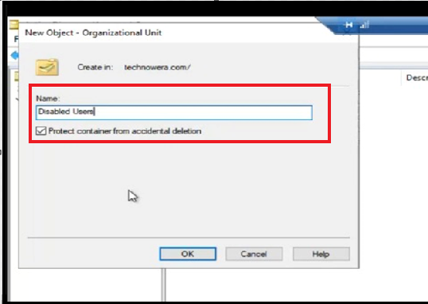
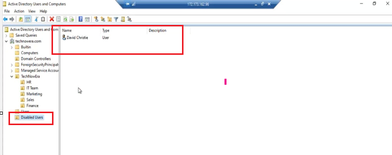
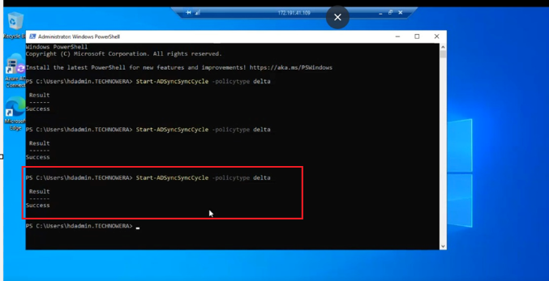
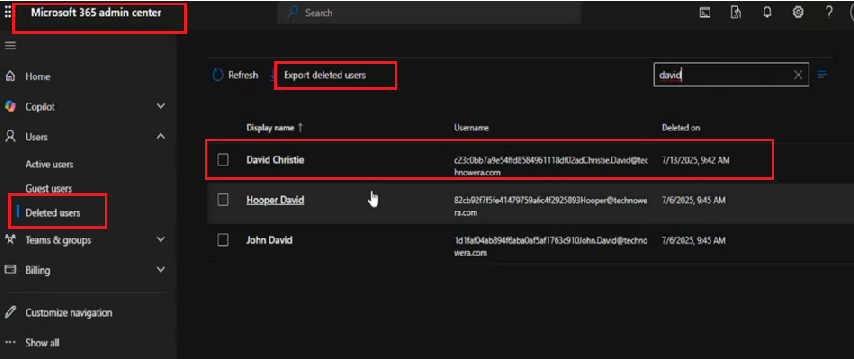

# Hybrid User Offboarding and Account Decommissioning in Microsoft 365

## 📌 Project Overview

This lab demonstrates a hybrid identity offboarding scenario in which a resigned employee account is disabled and removed from active use across an on-premises Active Directory and Microsoft 365 environment.

The objective was to simulate a real-world employee offboarding process and ensure that access is properly revoked and the identity lifecycle change is synchronized to Microsoft Entra ID and Microsoft 365.

---

## 🏢 Business Scenario

An employee, David Christie, has resigned from the organization.

The organization uses an on-premises Active Directory environment synchronized with Microsoft Entra ID and Microsoft 365.

As part of the offboarding process, the administrator must:

- Disable the employee's Active Directory account
- Create a dedicated Disabled Users Organizational Unit (OU)
- Move the resigned employee account to the Disabled Users OU
- Synchronize the identity change to Microsoft Entra ID
- Verify the account status in Microsoft 365
- Confirm that the resigned employee no longer has active access

---

## 🎯 Lab Objectives

The objectives of this lab were to:

1. Identify the resigned employee account in Active Directory.
2. Disable the employee account.
3. Create a dedicated Disabled Users OU.
4. Move the disabled account into the appropriate OU.
5. Trigger directory synchronization.
6. Verify the identity change in Microsoft 365.
7. Validate the completed user offboarding process.

---

## 🏗️ Architecture

The lab follows this hybrid identity lifecycle:

**Resigned Employee → Active Directory → Account Disabled → Disabled Users OU → Microsoft Entra Connect → Microsoft Entra ID → Microsoft 365**

The on-premises Active Directory remains the source for managing the synchronized identity, while Microsoft Entra Connect synchronizes the identity lifecycle changes to the cloud environment.

---

# 🔧 Implementation

## Step 1 — Identify and Disable the Resigned User Account

The resigned employee account was located in Active Directory Users and Computers.

The account was disabled to prevent the user from continuing to authenticate using the organizational identity.

>

---

## Step 2 — Create the Disabled Users Organizational Unit

A dedicated **Disabled Users** Organizational Unit was created in Active Directory.

This provides a structured location for separating inactive or resigned employee accounts from active user accounts.

> 

---

## Step 3 — Move the Resigned User to the Disabled Users OU

After disabling the account, the resigned employee identity was moved into the **Disabled Users** OU.

This helps maintain a clear administrative structure and separates inactive identities from active employees.

>

---

## Step 4 — Synchronize the Identity Change

After completing the Active Directory changes, a delta synchronization was initiated to process the updated identity information.

This allows the offboarding changes made in the on-premises directory to be synchronized to the Microsoft cloud identity environment.

> 

---

## Step 5 — Verify the User Status in Microsoft 365

The Microsoft 365 environment was reviewed after synchronization to verify the status of the resigned employee identity.

The account status was checked to confirm that the offboarding change had been reflected in the cloud environment.

> 

---

## ✅ Validation

The completed offboarding workflow was validated across the hybrid identity environment.

The validation confirmed that:

- The resigned employee account was disabled
- The account was separated from active users
- The account was placed within the Disabled Users OU
- Directory synchronization was performed
- The identity lifecycle change was reflected in the Microsoft 365 environment

This demonstrated the process of managing a user through the **leaver stage of the identity lifecycle** in a hybrid environment.

---

## 🛠️ Technologies Used

- Windows Server
- Active Directory Domain Services (AD DS)
- Active Directory Users and Computers (ADUC)
- Microsoft Entra Connect
- Microsoft Entra ID
- Microsoft 365 Admin Center
- PowerShell
- Hybrid Identity

---

## 🔐 Skills Demonstrated

- User offboarding
- Identity lifecycle management
- Active Directory administration
- Account disablement
- Organizational Unit management
- Hybrid identity administration
- Directory synchronization
- Microsoft Entra ID administration
- Microsoft 365 administration
- Access revocation
- Identity validation

---

## 💡 Key Learning

This project strengthened my understanding of the **leaver process within identity lifecycle management**.

It demonstrated that employee offboarding involves more than disabling an account. Administrators must ensure that identity changes are correctly managed in the source directory, synchronized to the cloud environment, and validated to confirm that access has been appropriately revoked.

---

## 🔒 Lab Environment

This project was completed in a personal/training lab environment.

All identities and configurations shown in this project are for learning and demonstration purposes only and do not contain confidential employer or customer information.
