# 06 — Microsoft Entra Privileged Identity Management (PIM) with Group-Based Role Assignment

## Project Overview

In this project, I configured Microsoft Entra Privileged Identity Management (PIM) to provide eligible access to the **Security Reader** role through a role-assignable security group.

Instead of assigning the privileged role directly to a user, I assigned the role to a security group and configured the assignment as **Eligible**.

I then signed in using a separate test user account to verify that the user inherited the eligible role through group membership and could activate the role when required.

---

## Objectives

- Create a role-assignable security group
- Add test users to the group
- Assign the Security Reader role to the group
- Configure the role assignment as Eligible
- Verify the eligible group assignment
- Sign in using a separate test user
- Verify inherited role eligibility
- Activate the Security Reader role
- Confirm that the role becomes temporarily active

---

## Lab Environment

- Microsoft Entra ID
- Microsoft Entra Privileged Identity Management (PIM)
- Microsoft Azure Portal
- Test tenant: Contoso
- Security group: `Audit_test_2`
- Test user: `PIM_User`
- Microsoft Entra role: `Security Reader`

---

# Implementation

## Step 1 — Create the Role-Assignable Security Group

I first created a new security group that could be used for Microsoft Entra role assignments.

I navigated to:

**Microsoft Entra ID → Groups → All groups → New group**

The group was configured as:

- Group type: Security
- Group name: `Audit_test_2`
- Microsoft Entra roles can be assigned to the group: Yes
- Membership type: Assigned
- Members: Selected test users

Enabling **Microsoft Entra roles can be assigned to the group** allows the group to be used for Microsoft Entra role assignments.

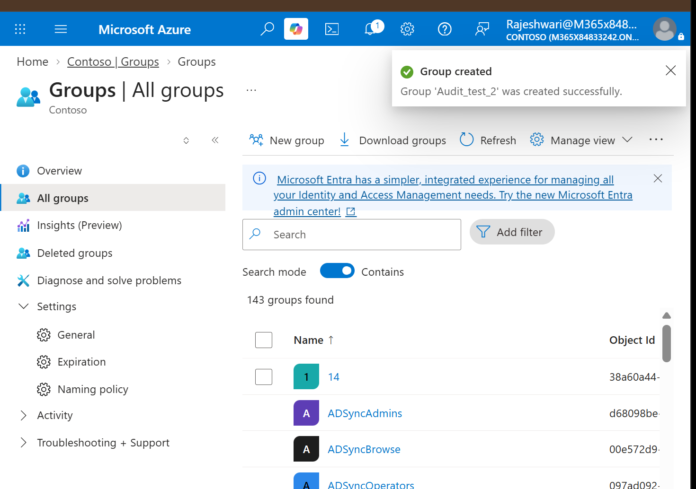

---

## Step 2 — Open Privileged Identity Management

After creating the group, I opened **Privileged Identity Management** and selected **Microsoft Entra roles**.

From the PIM Quick Start page, I used **Assign Eligibility** to configure an eligible role assignment.

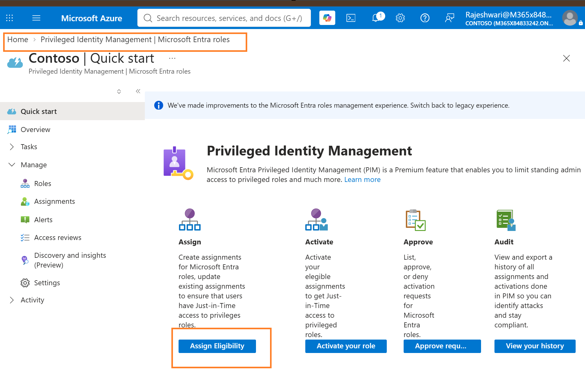

---

## Step 3 — Select the Security Reader Role

Under Microsoft Entra roles, I opened **Roles** and searched for **Security Reader**.

The Security Reader role provides read access to security information and reports without providing permissions to modify the security configuration.

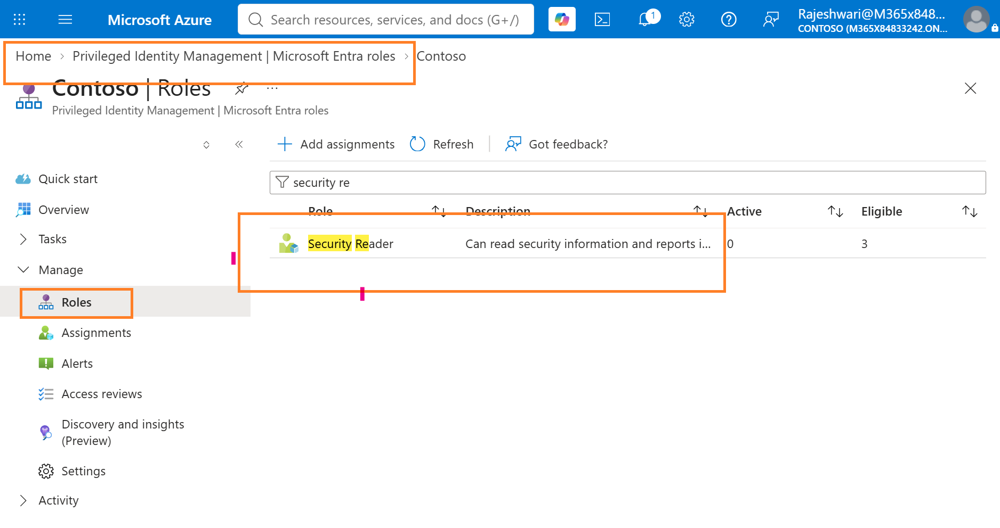

---

## Step 4 — Start the Role Assignment

I opened the **Security Reader** role and selected **Add assignments**.

This started the process of assigning Security Reader through PIM.

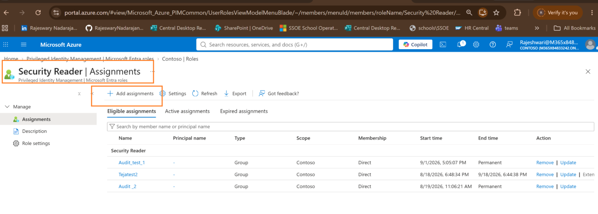

---

## Step 5 — Select the Security Group

For the role assignment, I selected the `Audit_test_2` security group.

The assignment configuration was:

- Role: Security Reader
- Scope: Directory
- Member: `Audit_test_2`

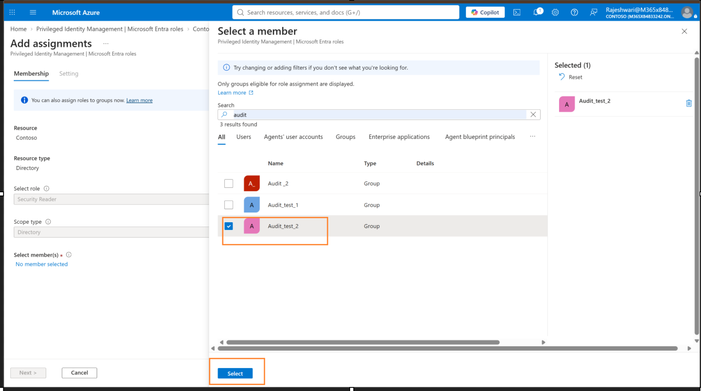

The selected group was then confirmed before continuing to the assignment settings.

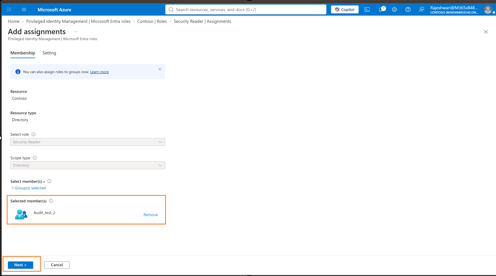

---

## Step 6 — Configure the Assignment as Eligible

In the assignment settings, I selected:

- Assignment type: **Eligible**
- Eligibility: **Permanently eligible**

I then selected **Assign** to complete the configuration.

This makes the group eligible for the Security Reader role without keeping the role continuously active.

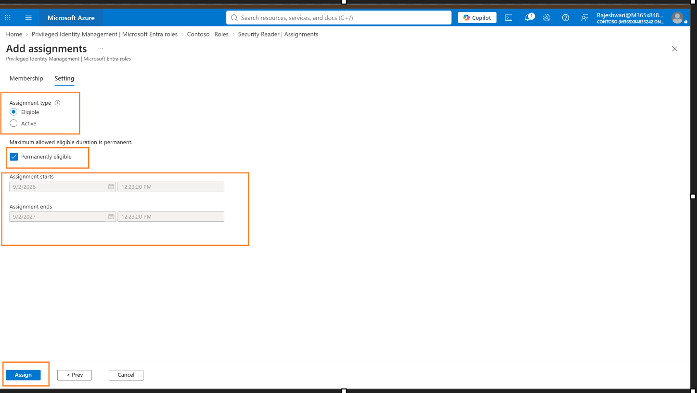

---

## Step 7 — Confirm the Role Assignment

Microsoft Entra successfully completed the role assignment for `Audit_test_2`.

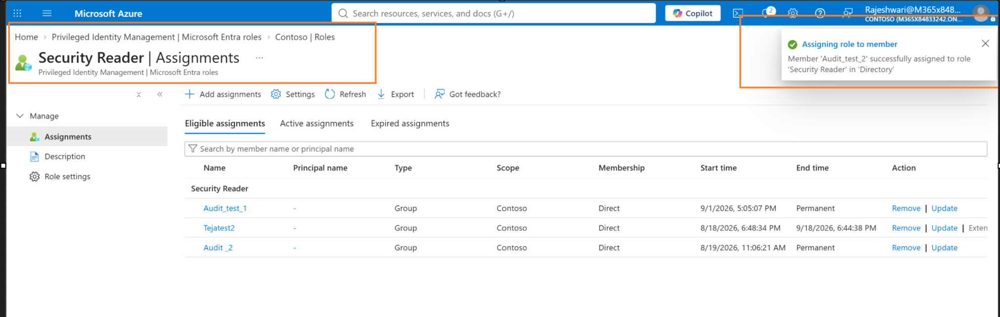

I then verified the configuration under:

**Security Reader → Assignments → Eligible assignments**

The `Audit_test_2` group appeared as an eligible assignment for Security Reader.

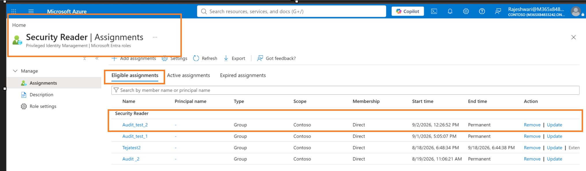

---

# User-Side Testing

## Step 8 — Sign In as the Test User

To test the configuration from the user's side, I opened a separate browser session and signed in using the `PIM_User` test account.

Using a separate account allowed me to verify the PIM experience from the perspective of a user receiving privileged access through group membership.

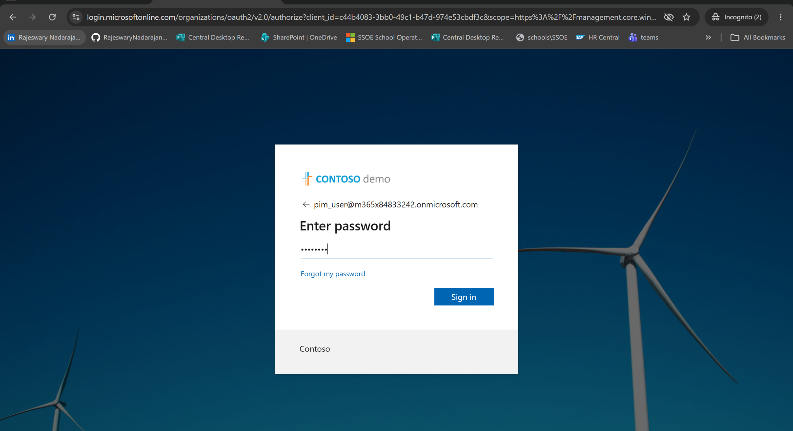

---

## Step 9 — Complete MFA Registration

During sign-in, the test user was required to register Microsoft Authenticator.

I completed the authentication-method registration for the account before continuing to the Azure portal.

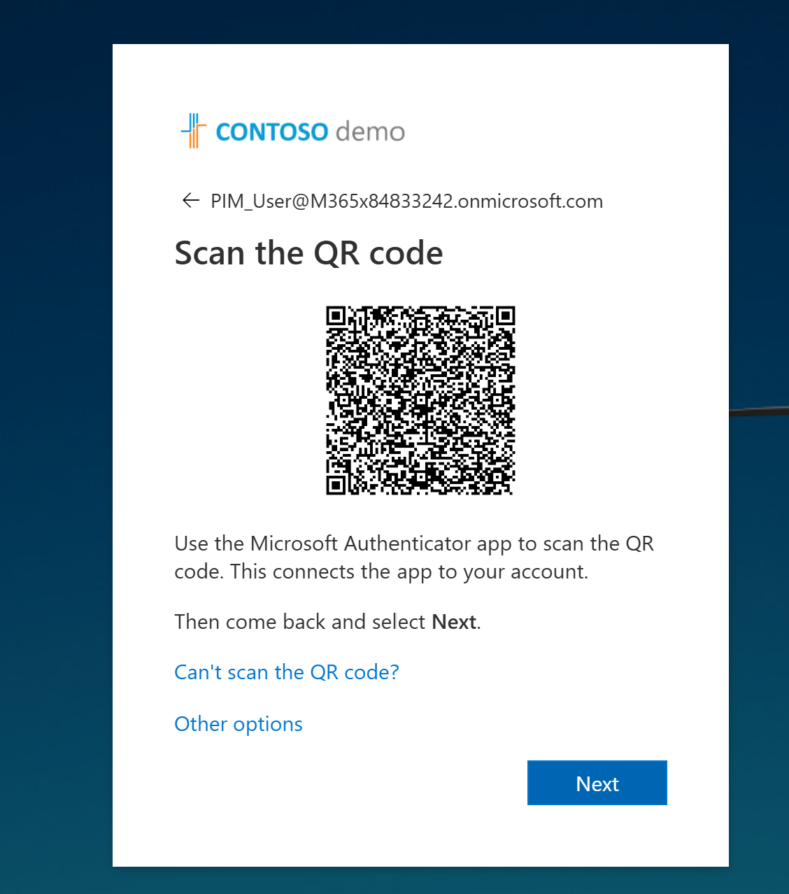

After completing the sign-in process, the `PIM_User` account was successfully authenticated.

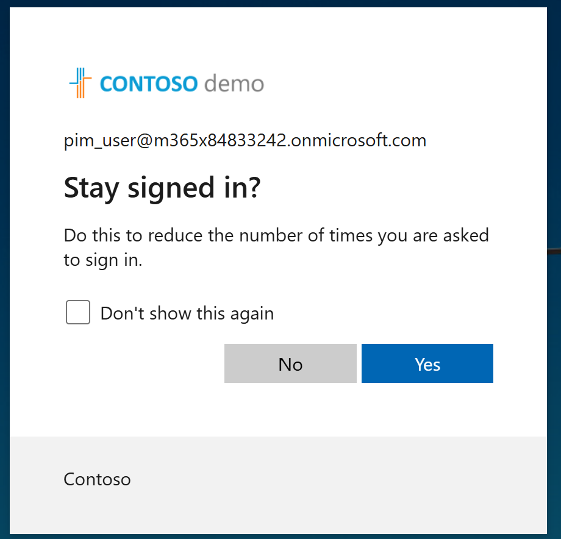

---

## Step 10 — Verify the Eligible Role

While signed in as `PIM_User`, I navigated to:

**Privileged Identity Management → My roles → Microsoft Entra roles → Eligible assignments**

The **Security Reader** role was available to the user with:

- Role: Security Reader
- Scope: Contoso
- Membership: Group
- Action: Activate

The **Group** membership shows that the eligible role was received through group membership rather than being assigned directly to the user.

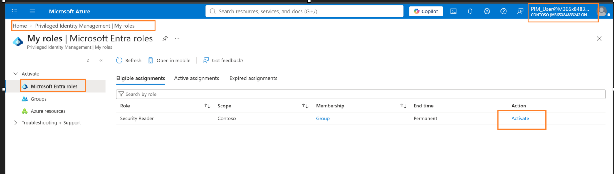

---

## Step 11 — Activate the Security Reader Role

I selected **Activate** for the Security Reader role.

The PIM activation screen allowed the activation start time and duration to be configured.

For this test, I configured the role for temporary activation.

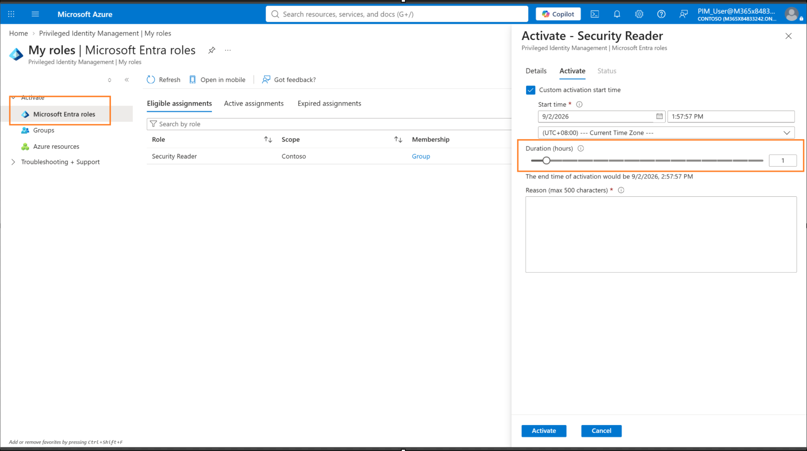

I then submitted the activation request.

---

## Step 12 — Confirm Successful Activation

Microsoft Entra PIM processed the request and validated the activation.

The activation completed successfully through all three stages.

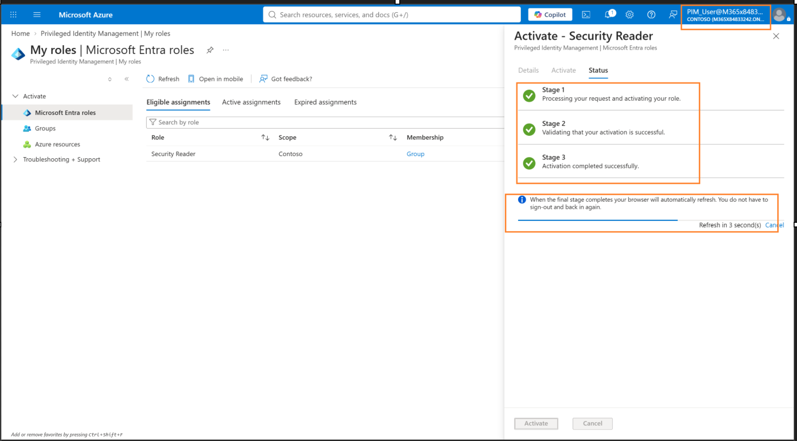

After activation, Microsoft Entra displayed a notification indicating that the user's active assignments had changed.

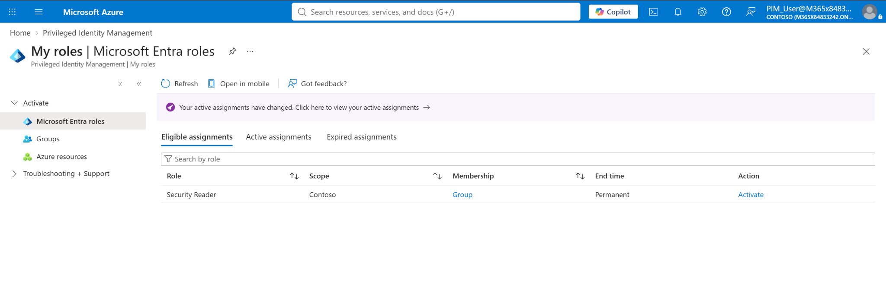

---

## Step 13 — Verify the Active Assignment

Finally, I opened the **Active assignments** tab.

The Security Reader role showed:

- Role: Security Reader
- Scope: Contoso
- Membership: Group
- State: Activated
- Temporary end time
- Action: Deactivate

This confirmed that `PIM_User` successfully activated the Security Reader role through the group-based eligible assignment.

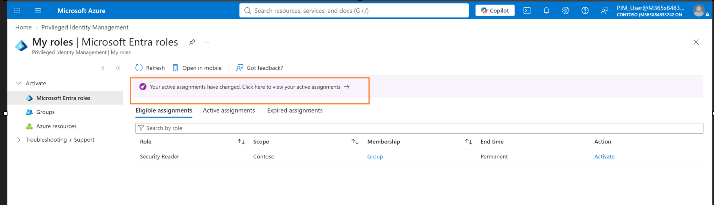

The role could also be manually deactivated before the activation period expired.

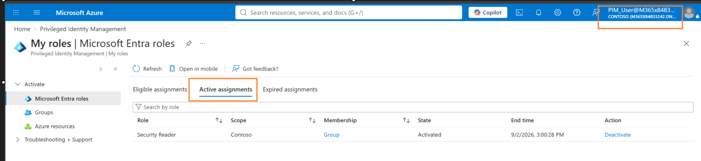

---

# Access Flow

`PIM_User`

↓ Member of

`Audit_test_2`

↓ Group configured as eligible for

`Security Reader`

↓ User inherits eligible role through group membership

`Eligible`

↓ User activates the role when required

`PIM Activation`

↓ Role becomes temporarily active

`Security Reader — Active`

↓ Role expires automatically or can be manually deactivated

---

# Security Concepts Demonstrated

## Least Privilege

The user does not need to maintain continuously active Security Reader access. The role can remain eligible and be activated when required.

## Just-In-Time (JIT) Access

PIM allows the eligible role to be activated temporarily instead of maintaining standing privileged access.

## Group-Based Role Assignment

The Security Reader eligibility was assigned to a role-assignable security group instead of directly assigning the role to the individual test user.

## Eligible vs Active Assignment

An **Eligible** assignment makes the role available for activation when required.

An **Active** assignment means the privileged role is currently activated and available to the user.

## Privileged Identity Management

Microsoft Entra PIM provides control over privileged role eligibility and activation, helping reduce unnecessary standing access.

---

# Result

I successfully configured and tested an end-to-end Microsoft Entra PIM workflow using a role-assignable security group.

The `Audit_test_2` group was configured as eligible for the **Security Reader** role. A test account, `PIM_User`, received the eligible role through group membership.

I then signed in using the test account, verified the inherited eligibility, activated Security Reader through PIM, and confirmed that the role appeared under **Active assignments** with a temporary activation period.

---

## Skills Demonstrated

- Microsoft Entra ID
- Microsoft Entra Privileged Identity Management (PIM)
- Role-assignable security groups
- Microsoft Entra role management
- Security Reader role
- Eligible and Active role assignments
- Group-based role assignment
- Privileged role activation
- Just-In-Time (JIT) access
- Least-privilege access
- MFA / Microsoft Authenticator
- Privileged access validation

---

## Lab Environment Notice

This project was completed in a personal/training Microsoft Entra lab environment.

All users, groups, tenant information, and configurations shown in the screenshots were created for learning and skills demonstration purposes.
