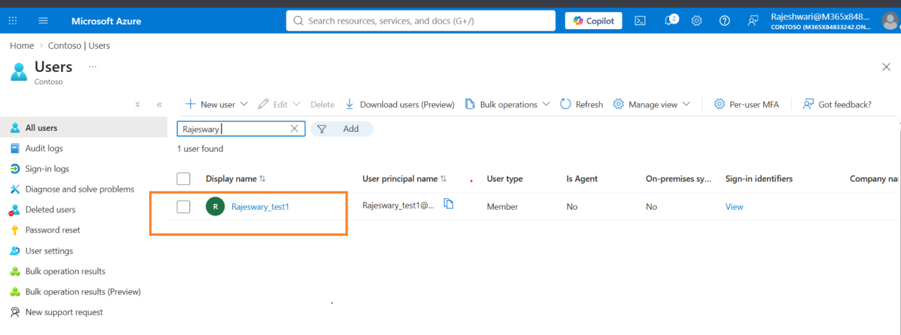
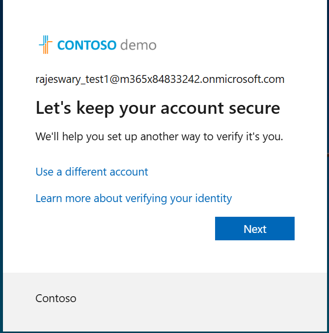
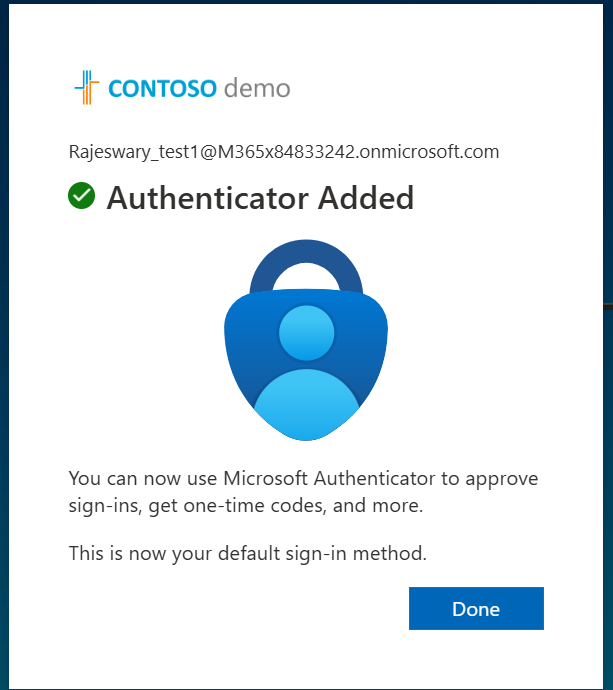

# Microsoft 365 Access Troubleshooting with Entra ID Conditional Access

## Project Overview

In this lab, I created a test user and simulated a Microsoft 365 access issue.

The user was able to authenticate, but Outlook could not be accessed because the account did not have the required Microsoft 365 license and Exchange Online mailbox.

I investigated the issue, assigned the required license, verified the Exchange Online service and mailbox, and then configured a Conditional Access policy requiring MFA.

Finally, I reviewed the Entra ID sign-in logs to confirm that the Conditional Access policy was applied successfully.

---

## Lab Environment

- Microsoft Entra ID
- Microsoft 365 Admin Center
- Exchange Admin Center
- Microsoft 365 E5 (no Teams)
- Exchange Online Plan 2
- Conditional Access
- Microsoft Authenticator
- Passkey
- Entra ID Sign-in Logs

Test user:

`Rajeswary_test1`

---

## Step 1 – Create a Test User

I created a new test user in Microsoft Entra ID.

The account was created as a Member user.

---

## Step 2 – Register Microsoft Authenticator

During the first sign-in, the user was prompted to set up additional authentication.

I configured Microsoft Authenticator for the test account.

I continued with the Microsoft Authenticator setup.

The number matching request was displayed during authentication.

Microsoft Authenticator was successfully added as an authentication method.

---

## Step 3 – Initial Access Check

After authentication, I tested access using the account.

The user could authenticate successfully, but the Azure portal showed:

`You don't have access`

with error code:

`401`

This showed that authentication itself was working, but I still needed to investigate the Microsoft 365 application access issue separately.

---

## Step 4 – Check Microsoft 365 Licensing

I checked the user's account in the Microsoft 365 Admin Center.

The user had no Microsoft 365 license assigned.

---

## Step 5 – Test Outlook Access

I signed in to Microsoft 365 using the test account and attempted to open Outlook.

Outlook returned an error.

The important error shown was:

`OwaUserHasNoMailboxAndNoLicenseAssignedException`

This confirmed that the Outlook issue was related to the user not having a mailbox and the required license.

---

## Step 6 – Assign Microsoft 365 E5 License

I returned to the Microsoft 365 Admin Center and assigned:

`Microsoft 365 E5 (no Teams)`

to the test user.

---

## Step 7 – Verify Exchange Online Service

I checked the applications included with the Microsoft 365 E5 license.

I confirmed that:

`Exchange Online (Plan 2)`

was enabled for the user.

---

## Step 8 – Verify Mailbox Provisioning

I opened the Exchange Admin Center and checked the mailbox list.

The test user now appeared as a user mailbox.

This confirmed that the Exchange Online mailbox had been provisioned successfully.

---

## Step 9 – Verify Outlook Access

I signed in again with the test account and tested Outlook.

After the license and mailbox were provisioned, Outlook loaded successfully.

The original Microsoft 365 application access issue was now resolved.

---

## Step 10 – Configure Passkey

I also configured a passkey for the test account.

The passkey was successfully created and could be used with supported sign-in methods such as Windows Hello.

---

## Step 11 – Create Conditional Access Policy

Next, I created a Conditional Access policy for the test user.

I selected `Rajeswary_test1` as the user included in the policy.

The policy was configured with:

- Policy name: `LAB-CA-RajeswaryTest1-Require-MFA`
- User: `Rajeswary_test1`
- Target resources: All resources
- Grant access: Require multifactor authentication
- Policy state: On

---

## Step 12 – Create and Enable the Policy

I created the Conditional Access policy.

The portal confirmed that:

`LAB-CA-RajeswaryTest1-Require-MFA`

was created successfully.

---

## Step 13 – Test Sign-In After Applying Conditional Access

I signed in again using the test account after enabling the Conditional Access policy.

The authentication completed successfully.

---

## Step 14 – Review Entra ID Sign-In Logs

I checked the Entra ID sign-in logs to validate the authentication result.

The sign-in showed:

- Authentication requirement: Multifactor authentication
- Status: Success
- User: Rajeswary_test1

The log also showed:

`MFA requirement satisfied by claim in the token`

This explained why I was not prompted for another MFA challenge during that sign-in. The existing authentication claim in the token already satisfied the MFA requirement.

---

## Step 15 – Verify Conditional Access Result

I opened the Conditional Access details for the sign-in.

The policy showed:

- Policy: `LAB-CA-RajeswaryTest1-Require-MFA`
- Policy state: Enabled
- Result: Success
- User: Rajeswary_test1 – Matched
- Resource: Office 365 Exchange Online – Matched
- Network: Not configured

This confirmed that the Conditional Access policy matched the user and Exchange Online sign-in successfully.

It also showed that network/location was not configured as a condition in this policy.

---

## Troubleshooting Summary

The main issue in this lab was not the user's password or Conditional Access.

The user could authenticate, but Outlook initially failed with:

`OwaUserHasNoMailboxAndNoLicenseAssignedException`

My troubleshooting process was:

1. Created and tested the user account.
2. Configured an authentication method.
3. Reproduced the Microsoft 365 application access problem.
4. Checked the user's Microsoft 365 licensing.
5. Identified that no license was assigned.
6. Assigned Microsoft 365 E5 (no Teams).
7. Verified Exchange Online Plan 2.
8. Verified that the Exchange Online mailbox was provisioned.
9. Retested Outlook successfully.
10. Created a Conditional Access policy requiring MFA.
11. Tested the sign-in again.
12. Reviewed Entra ID sign-in logs.
13. Confirmed that the Conditional Access policy was successfully applied.

---

## What I Learned

This lab helped me understand that a Microsoft 365 access problem should not immediately be treated as an MFA or Conditional Access problem.

I checked the issue across different areas including:

- User identity
- Authentication methods
- Microsoft 365 licensing
- Exchange Online service assignment
- Mailbox provisioning
- Conditional Access
- Entra ID sign-in logs

I also learned how Entra ID sign-in logs can be used to understand why an MFA requirement was satisfied without showing another MFA prompt.

---

## Result

The Microsoft 365 Outlook access issue was successfully resolved by assigning the required Microsoft 365 license and verifying mailbox provisioning.

Conditional Access was then configured and validated successfully through Entra ID sign-in logs.
