# Microsoft 365 Access Troubleshooting – Licensing, Exchange Online & Conditional Access MFA

## Project Overview

In this lab, I created a test user in Microsoft Entra ID and performed end-to-end troubleshooting of a Microsoft 365 application access issue.

The test user was initially unable to access Outlook. I investigated the issue by checking the user account, Microsoft 365 licensing, Exchange Online services, mailbox provisioning, authentication methods, and Microsoft Entra sign-in logs.

After resolving the Outlook access issue, I created a Conditional Access policy to require multifactor authentication (MFA) and validated the policy result using Microsoft Entra sign-in logs.

---

## Lab Scenario

**Test User:** `Rajeswary_test1`

The objective of this lab was to:

- Create and configure a Microsoft Entra ID test user.
- Register Microsoft Authenticator.
- Reproduce a Microsoft 365 application access issue.
- Troubleshoot Microsoft 365 licensing.
- Identify the Outlook mailbox error.
- Assign the required Microsoft 365 license.
- Verify Exchange Online service availability.
- Verify Exchange Online mailbox provisioning.
- Retest Microsoft 365 access.
- Configure Conditional Access to require MFA.
- Validate MFA and Conditional Access through Microsoft Entra sign-in logs.

---

# Implementation & Troubleshooting Steps

## Step 1 – Create the Test User

I opened the **Microsoft Entra Admin Center** and navigated to:

`Identity > Users > All users`

I created the following test account:

`Rajeswary_test1`

The account was created as a **Member** user in Microsoft Entra ID.

---

## Step 2 – Register Microsoft Authenticator

I signed in using the `Rajeswary_test1` account.

During the initial sign-in, Microsoft prompted the user to secure the account.

I selected Microsoft Authenticator and continued with the authentication method setup.

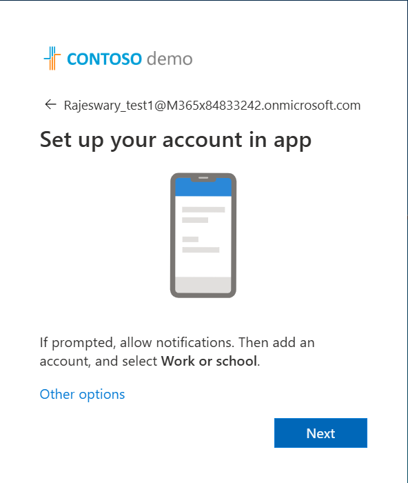

I completed the Microsoft Authenticator number-matching verification.

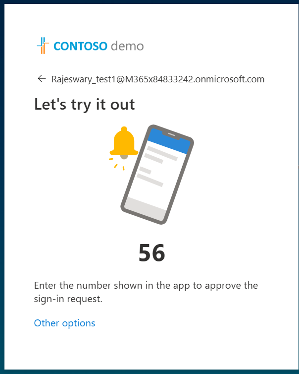

Microsoft Authenticator was successfully added to the account.

---

## Step 3 – Perform Initial Access Testing

After configuring the account, I tested access to Microsoft services using the test user.

During the Azure portal access test, the account received an unauthorized access response.

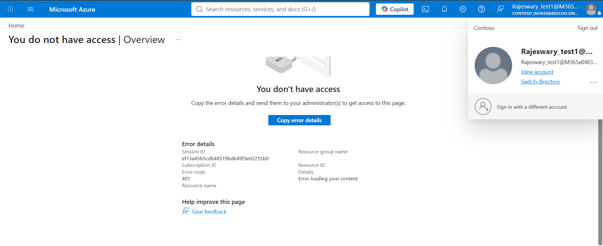

The Azure portal access result indicated that the authenticated account did not have authorization to access the requested Azure content.

I continued troubleshooting the Microsoft 365 application issue separately by checking the user's licensing and Outlook access.

---

## Step 4 – Check Microsoft 365 Licensing

I opened the **Microsoft 365 Admin Center** and navigated to:

`Users > Active users > Rajeswary_test1`

I checked the user's licensing status.

The user initially had:

`Licenses (0)`

This confirmed that no Microsoft 365 license was assigned to the test account.

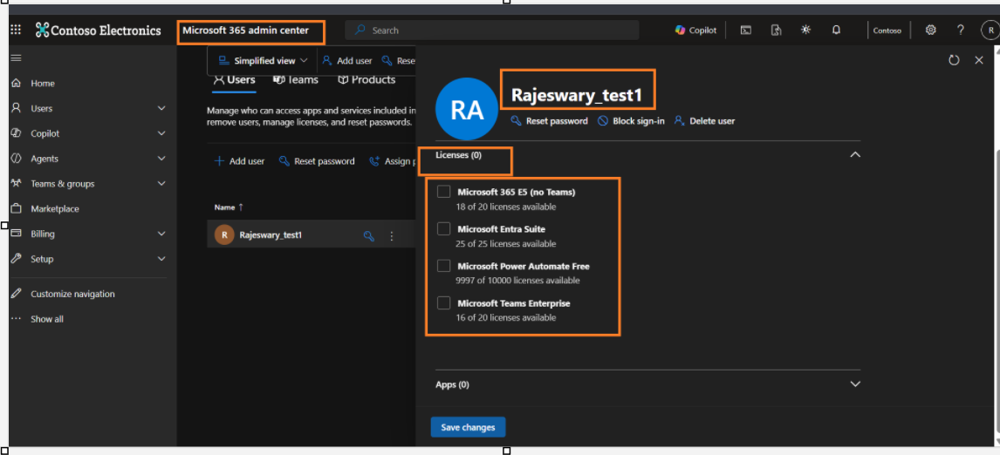

I also verified the user's license status from the account details.

---

## Step 5 – Reproduce the Outlook Access Issue

I signed in to Microsoft 365 using the `Rajeswary_test1` account and attempted to open Outlook.

Outlook returned the following error:

`OwaUserHasNoMailboxAndNoLicenseAssignedException`

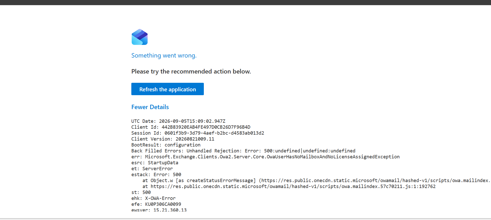

This was important troubleshooting evidence because Outlook had reached the account, but an Exchange Online mailbox and the required license were not available for the user at the time of testing.

---

## Step 6 – Assign Microsoft 365 E5 License

To resolve the licensing issue, I returned to the **Microsoft 365 Admin Center**.

I selected the test user and assigned:

`Microsoft 365 E5 (no Teams)`

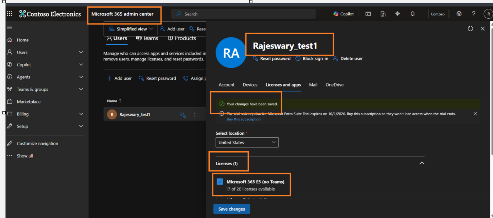

The license assignment provided the required Microsoft 365 services for the test account.

---

## Step 7 – Verify Exchange Online Service

After assigning the Microsoft 365 E5 license, I reviewed the applications and services included with the license.

I confirmed that:

`Exchange Online (Plan 2)`

was enabled for the user.

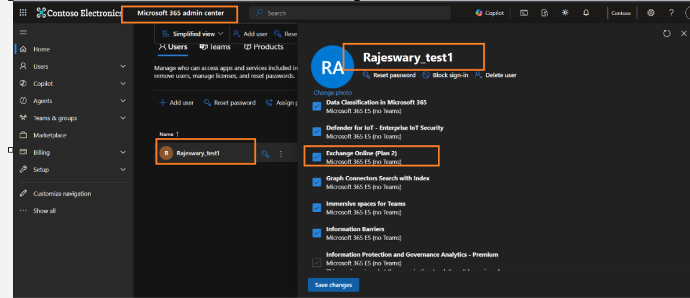

This confirmed that the user had the required Exchange Online service plan enabled.

---

## Step 8 – Retest Outlook After License Assignment

I tested Outlook again after assigning the Microsoft 365 license.

Outlook initially continued to display the mailbox/license error.

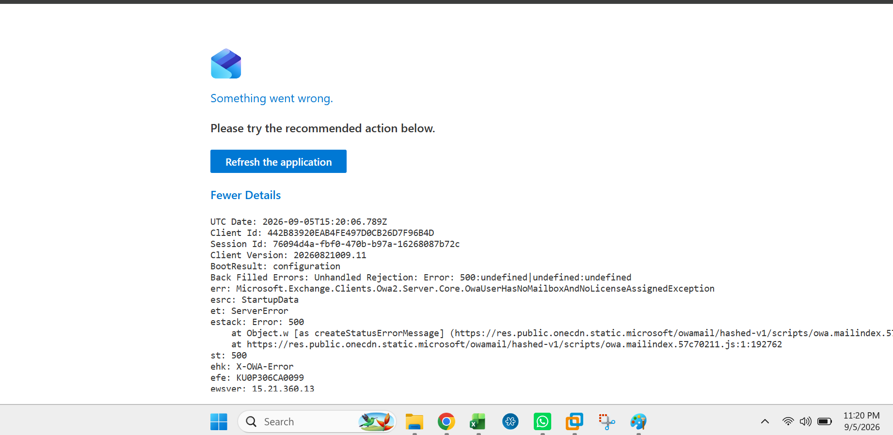

This indicated that assigning the license did not make the Exchange Online mailbox available immediately.

I continued troubleshooting by checking whether mailbox provisioning had completed.

---

## Step 9 – Verify Exchange Online Mailbox Provisioning

I opened the **Exchange Admin Center** and navigated to:

`Recipients > Mailboxes`

I searched for:

`Rajeswary_test1`

The account appeared as a:

`User mailbox`

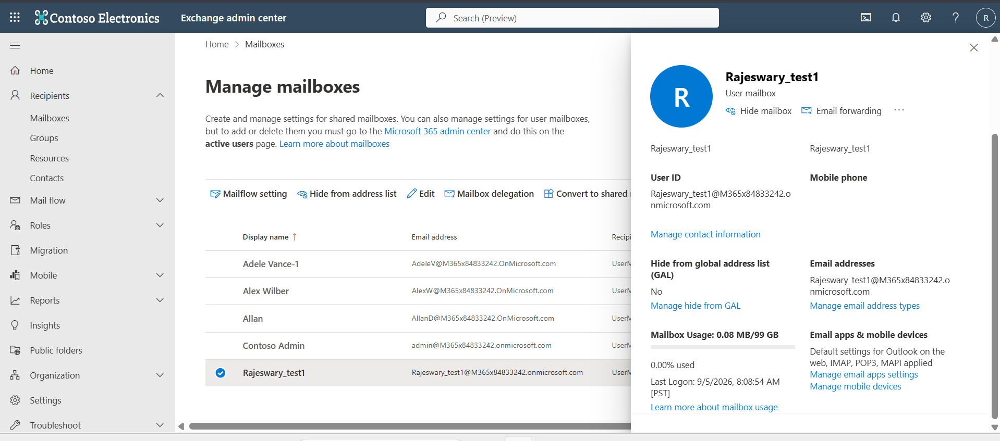

This confirmed that Exchange Online mailbox provisioning had completed successfully.

---

## Step 10 – Validate Microsoft 365 Access

After confirming that the mailbox had been provisioned, I signed out of the test account.

I opened a new browser session and signed in again using:

`Rajeswary_test1`

I then retested Microsoft 365 access.

The licensing and Exchange Online mailbox issue had been resolved.

This troubleshooting process confirmed that the original Outlook access problem was related to licensing and Exchange Online mailbox availability rather than Conditional Access.

---

## Step 11 – Validate Authentication Method

I also reviewed the authentication configuration for the test account.

A passkey was successfully created for `Rajeswary_test1`.

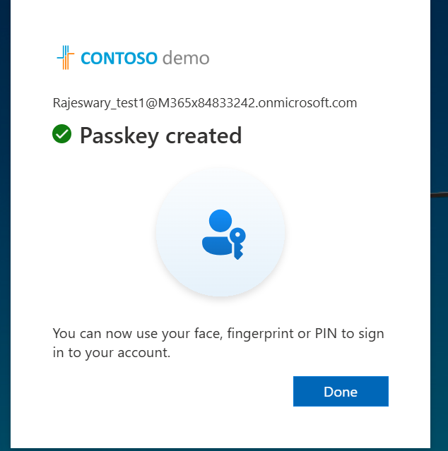

This provided an additional authentication method for the test account.

---

## Step 12 – Create Conditional Access MFA Policy

After resolving the Outlook access issue, I configured Conditional Access to enforce multifactor authentication.

I opened:

`Microsoft Entra Admin Center > Protection > Conditional Access > Policies`

I created the following policy:

`LAB-CA-RajeswaryTest1-Require-MFA`

I selected `Rajeswary_test1` as the target user.

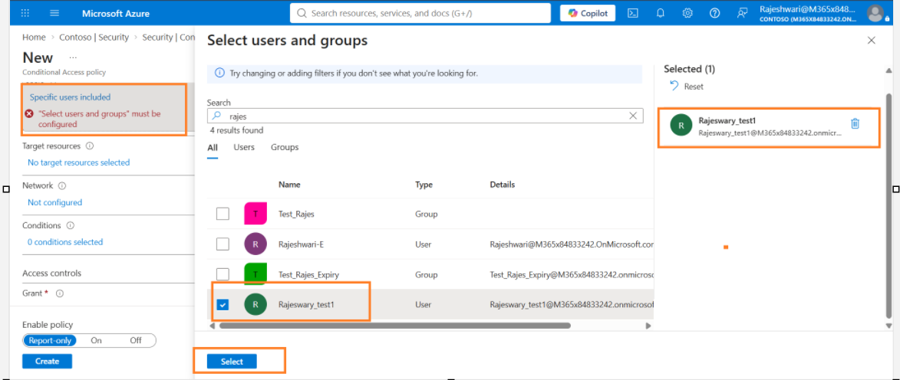

I configured the policy to require multifactor authentication.

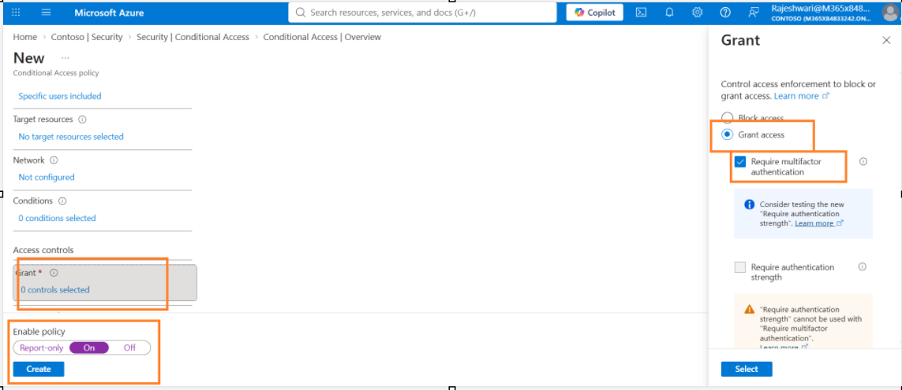

The policy configuration included:

- **User:** `Rajeswary_test1`
- **Grant:** Grant access
- **Access requirement:** Require multifactor authentication
- **Policy state:** On

The Conditional Access policy was then created successfully.

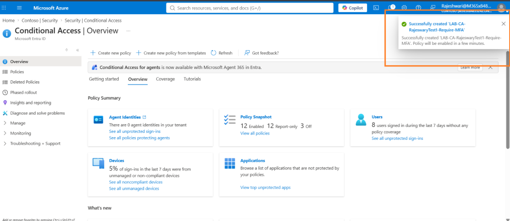

---

## Step 13 – Test Conditional Access Policy

After enabling the Conditional Access policy, I signed in again using the test account.

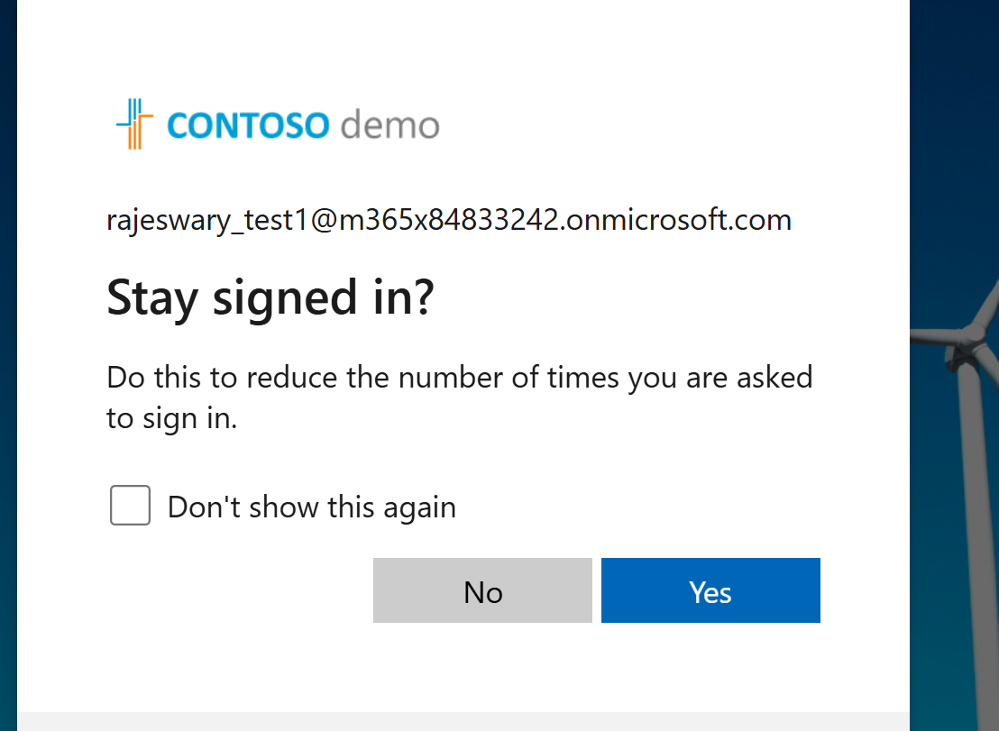

The sign-in completed successfully.

Microsoft Entra recorded the Conditional Access sign-in result.

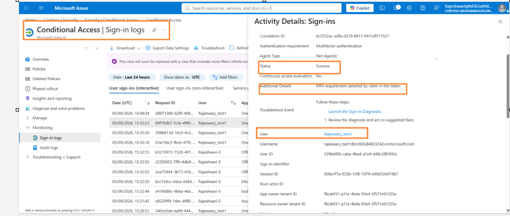

---

## Step 14 – Verify MFA in Microsoft Entra Sign-In Logs

I opened the Microsoft Entra sign-in logs and reviewed the relevant sign-in event for `Rajeswary_test1`.

The sign-in details showed:

`Authentication requirement: Multifactor authentication`

`Status: Success`

`MFA requirement satisfied by claim in the token`

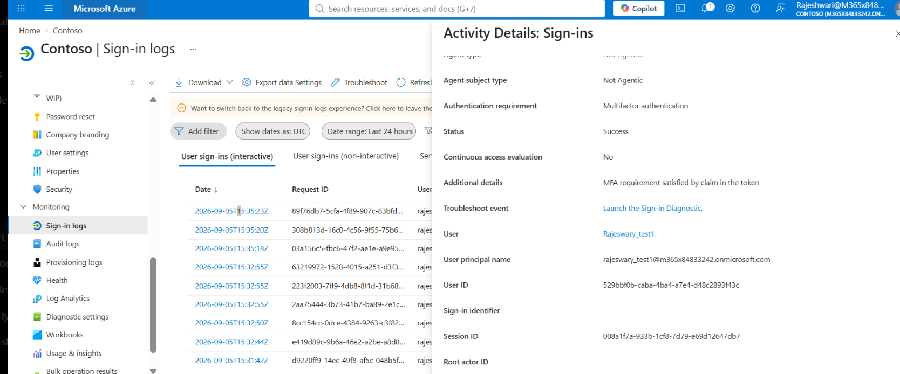

The Conditional Access policy required MFA, but another MFA prompt was not displayed during this test because the MFA requirement was already satisfied by an authentication claim present in the user's token.

---

## Step 15 – Validate Conditional Access Result

I reviewed the **Conditional Access** details for the successful sign-in.

The result showed:

- **Policy:** `LAB-CA-RajeswaryTest1-Require-MFA`
- **Policy state:** Enabled
- **Result:** Success
- **User:** `Rajeswary_test1` – Matched
- **Resource:** `Office 365 Exchange Online` – Matched
- **Network:** Not configured

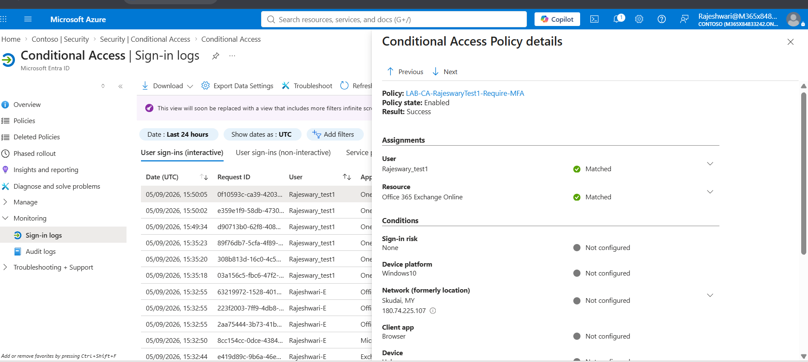

This confirmed that the Conditional Access policy was successfully applied to the test user.

The Conditional Access result also showed that the network condition was not configured for this policy. Therefore, network or named-location configuration was not responsible for this policy result.

---

# Root Cause

The main Outlook access issue was related to **Microsoft 365 licensing and Exchange Online mailbox availability**.

The troubleshooting process identified the following sequence:

1. `Rajeswary_test1` initially had no Microsoft 365 license.
2. Outlook returned `OwaUserHasNoMailboxAndNoLicenseAssignedException`.
3. I assigned `Microsoft 365 E5 (no Teams)`.
4. I verified that `Exchange Online (Plan 2)` was enabled.
5. Outlook initially continued to fail after license assignment.
6. I checked Exchange Admin Center to verify mailbox provisioning.
7. The account appeared as a `User mailbox`.
8. Microsoft 365 access was successfully validated after mailbox provisioning.
9. Conditional Access MFA was configured and tested separately.
10. Microsoft Entra sign-in logs confirmed successful MFA and Conditional Access evaluation.

---

# Resolution

The issue was resolved by:

- Assigning `Microsoft 365 E5 (no Teams)` to the test user.
- Verifying that `Exchange Online (Plan 2)` was enabled.
- Confirming Exchange Online mailbox provisioning in Exchange Admin Center.
- Retesting Microsoft 365 access after mailbox provisioning.
- Configuring Conditional Access to require MFA.
- Testing the user sign-in after enabling the policy.
- Reviewing Microsoft Entra sign-in logs.
- Validating the Conditional Access policy result.

---

# What I Learned

Through this lab, I gained hands-on experience troubleshooting Microsoft 365 application access across multiple identity and cloud services.

I practiced:

- Microsoft Entra ID user management
- Microsoft 365 user licensing
- Microsoft 365 application access troubleshooting
- Exchange Online service plan validation
- Exchange Online mailbox provisioning
- Outlook Web access troubleshooting
- Microsoft Authenticator registration
- Passkey authentication
- Microsoft Entra sign-in log analysis
- Conditional Access configuration
- Multifactor authentication enforcement
- MFA token claim validation
- Conditional Access policy troubleshooting

This lab demonstrated the importance of troubleshooting Microsoft 365 access layer by layer rather than assuming that every access failure is caused by Conditional Access.

The identity, licensing, Exchange Online mailbox, authentication, authorization, and Conditional Access components must be investigated separately to identify the actual root cause.

---

# Technologies Used

- Microsoft Entra ID
- Microsoft 365 Admin Center
- Exchange Admin Center
- Exchange Online
- Microsoft Outlook
- Microsoft Authenticator
- Microsoft Entra Conditional Access
- Multifactor Authentication (MFA)
- Passkey Authentication
- Microsoft Entra Sign-In Logs

---

# Project Outcome

Successfully diagnosed and resolved a Microsoft 365 Outlook access issue involving missing Microsoft 365 licensing and Exchange Online mailbox availability.

After resolving the application access issue, I implemented a Microsoft Entra Conditional Access policy requiring multifactor authentication.

I then validated the successful Conditional Access policy application and MFA requirement through Microsoft Entra sign-in logs.

This project demonstrates practical Microsoft 365 administration, Exchange Online troubleshooting, Microsoft Entra ID administration, Conditional Access configuration, MFA validation, and identity troubleshooting skills.
