# Project 8: Microsoft Entra Entitlement Management – Access Package & Multi-Stage Approval

## Project Overview

This project demonstrates the design, implementation, troubleshooting, and end-to-end validation of a **Microsoft Entra Entitlement Management Access Package** for an internal IDAM team onboarding scenario.

The objective was to simplify and govern access provisioning for new team members who require multiple groups, enterprise applications, SharePoint permissions, and privileged group access.

Instead of manually assigning each resource to every new employee, the required access is bundled into a single access package and governed through:

- Requestor restrictions
- Multi-stage approval
- Alternate/fallback approvers
- Privileged Identity Management (PIM)
- Time-bound assignments
- Extension controls
- Automated resource delivery

The business scenario represents onboarding **20 new IDAM team members** with the same access requirements.

For end-to-end lab validation, one test account was used to complete the full request, approval, provisioning, and access-validation workflow.

---

# Business Scenario

Assume 20 new employees are joining the **IDAM department**.

Each employee requires access to the following resources.

### Microsoft Entra Administrative Roles

- Intune Administrator
- Helpdesk Administrator

### SharePoint Online

- 1 SharePoint site as Owner
- 1 SharePoint site as Member
- 1 SharePoint site as Visitor/Viewer

### Enterprise Applications

- 5 Enterprise Applications

### Security Groups

Eight groups are required:

- 2 Active Member assignments
- 2 Active Owner assignments
- 2 Eligible Member assignments
- 2 Eligible Owner assignments

The eligible assignments are managed using **Microsoft Entra Privileged Identity Management (PIM) for Groups**.

---

# Governance Requirements

| Requirement | Configuration |
|---|---|
| Requestors | Internal IDAM department users only |
| Request method | Microsoft My Access |
| Approval stages | 2 |
| Stage 1 | Designated first-level approver |
| Stage 2 | Manager as approver |
| Alternate/Fallback | Dileep |
| Approval deadline | 4 days |
| Access duration | 45 days |
| Extension allowed | Yes |
| Extension approval | No |
| Privileged group access | PIM Eligible Member/Owner |

---

# Technologies Used

- Microsoft Entra ID
- Microsoft Entra Identity Governance
- Entitlement Management
- Access Packages
- Privileged Identity Management (PIM)
- PIM for Groups
- Microsoft 365
- SharePoint Online
- Enterprise Applications
- Microsoft My Access

---

# Implementation

## Step 1 – Create Identity Governance Catalog

Navigate to:

**Microsoft Entra Admin Center → Identity Governance → Entitlement Management → Catalogs**

Select:

**+ New catalog**

Configure:

**Name**

`CAT-IDAM-Governance-Lab`

**Description**

`Catalog for IDAM team access package and identity governance lab.`

Configure:

- Enabled for users to request: **Yes**
- Enabled for external users to request: **No**

Select **Create**.

The dedicated Identity Governance catalog is now available for the IDAM access package.

### Implementation Evidence

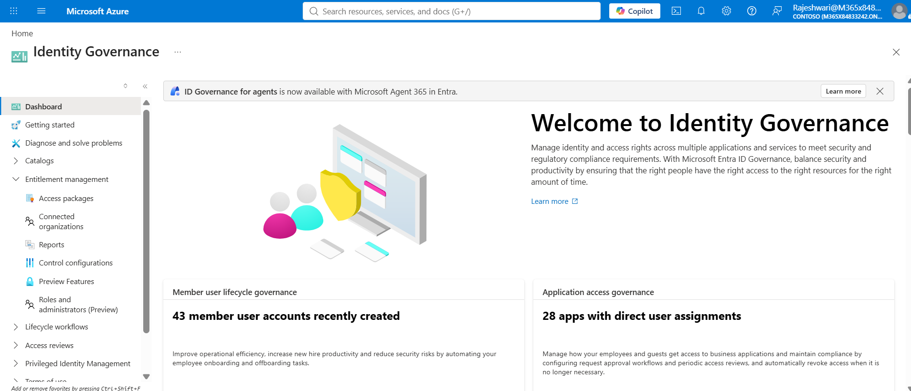

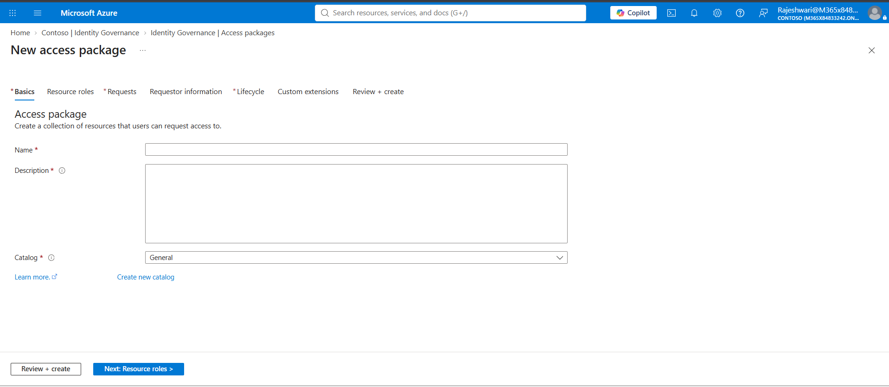

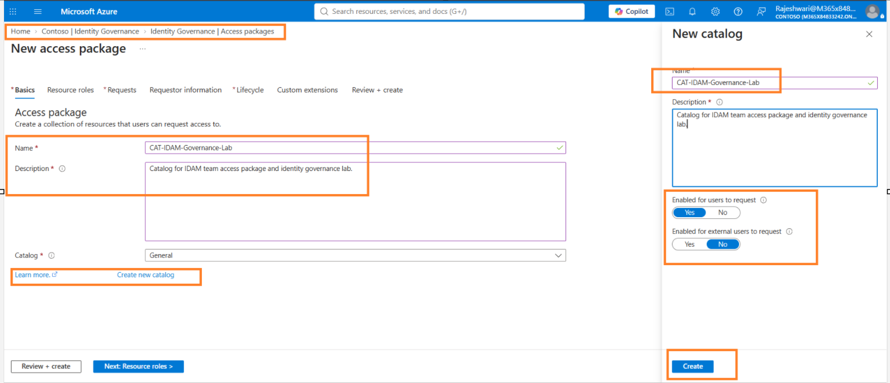

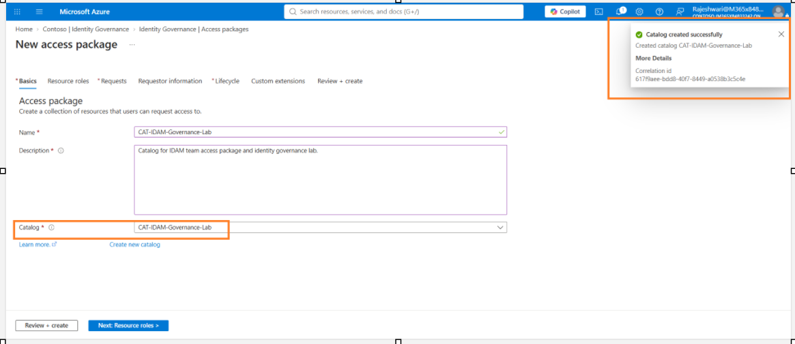

---

## Step 2 – Assign Catalog Owner

The administrator initially did not have sufficient catalog-level permissions to manage all required resources.

Navigate to:

**Identity Governance → Catalogs → CAT-IDAM-Governance-Lab → Roles and administrators**

Assign the administrator account as:

**Catalog Owner**

This allows the administrator to manage resources and access packages within the catalog.

### Implementation Evidence

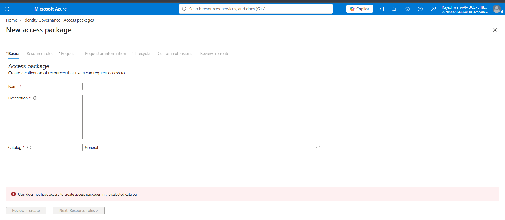


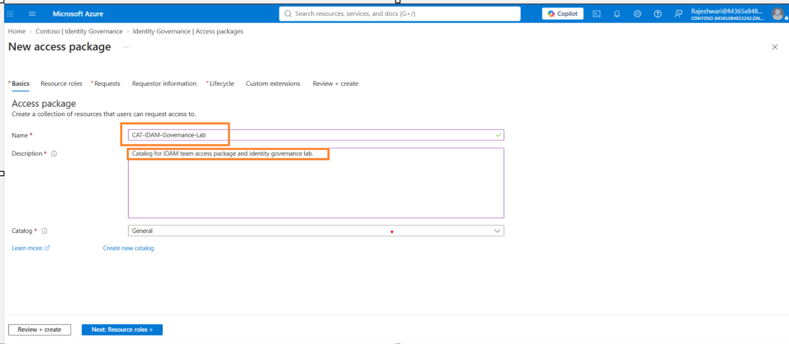

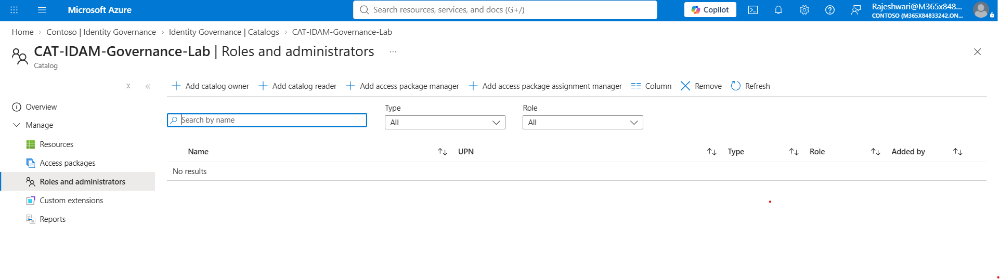

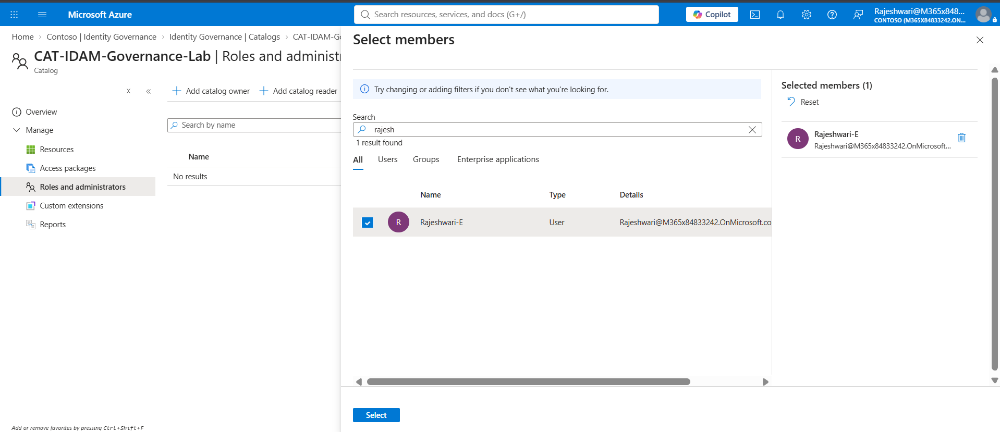
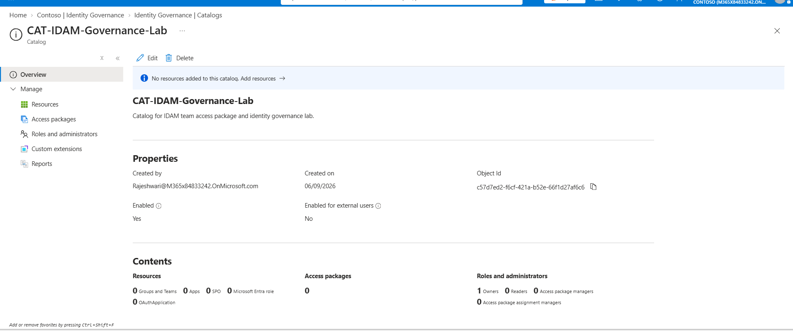

---

## Step 3 – Create the Access Package

Navigate to:

**Identity Governance → Entitlement Management → Access packages**

Select:

**+ New access package**

Configure:

**Name**

`AP-IDAM-Team-Access`

**Description**

`Access package for IDAM team members to request governed access to required roles, groups, applications and SharePoint resources.`

Select catalog:

`CAT-IDAM-Governance-Lab`

The access package acts as the central entitlement bundle for IDAM team onboarding.

### Implementation Evidence

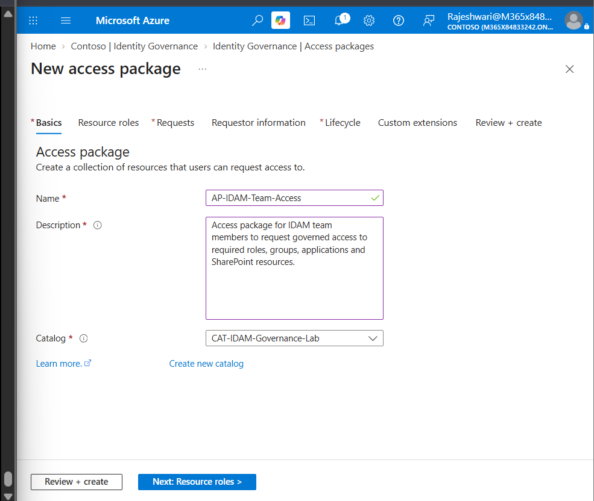


---

## Step 4 – Test Microsoft Entra Administrative Role Resources

The original business requirement included:

- Intune Administrator
- Helpdesk Administrator

From the access package, select:

**Add resource roles → Microsoft Entra role (Preview)**

Search for:

`Intune Administrator`

and:

`Helpdesk Administrator`

The shared lab tenant returned:

**No resource found**

The issue remained even after validating the administrative permissions and Catalog Owner assignment.

Therefore, the Entra administrative roles were documented as a **lab tenant / Preview feature limitation** rather than being represented as successfully implemented.

### Troubleshooting Evidence

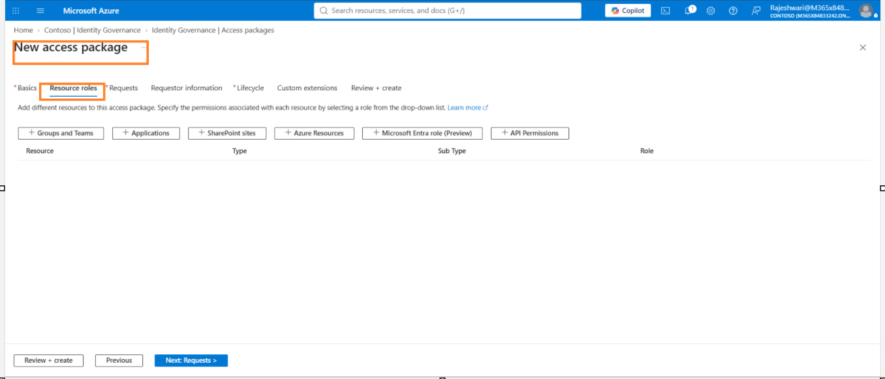

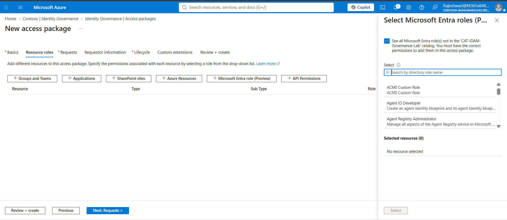

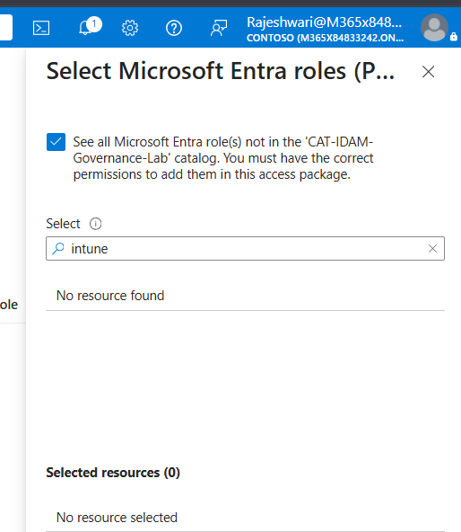

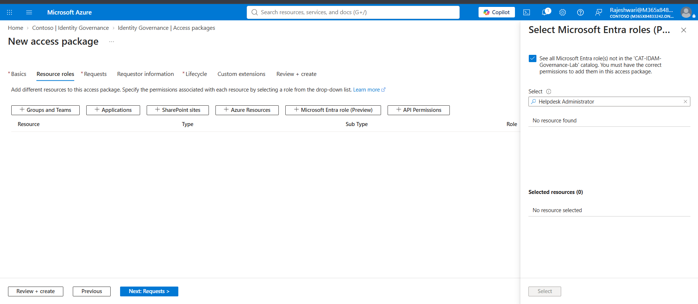

---

## Step 5 – Create Security Groups

Eight security groups were created to represent the different entitlement requirements.

Navigate to:

**Microsoft Entra ID → Groups → All groups → New group**

Configure the groups as **Security** groups with **Assigned** membership.

| Group | Required Access |
|---|---|
| LAB-IDAM-Group-01-Member | Member |
| LAB-IDAM-Group-02-Member | Member |
| LAB-IDAM-Group-03-Owner | Owner |
| LAB-IDAM-Group-04-Owner | Owner |
| LAB-IDAM-Group-05-Eligible-Member | Eligible Member |
| LAB-IDAM-Group-06-Eligible-Member | Eligible Member |
| LAB-IDAM-Group-07-Eligible-Owner | Eligible Owner |
| LAB-IDAM-Group-08-Eligible-Owner | Eligible Owner |

### Implementation Evidence

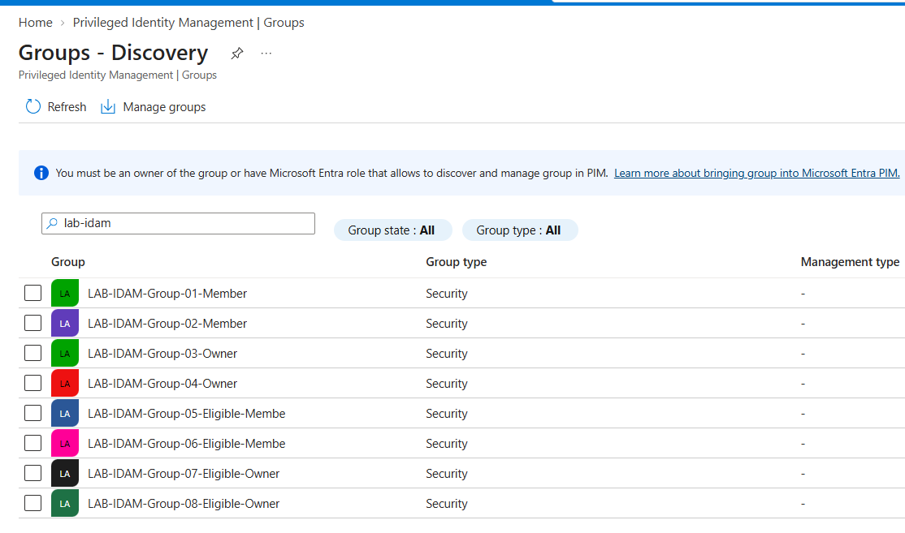

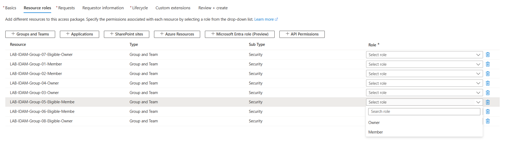


---

## Step 6 – Configure PIM for Eligible Groups

Groups 05–08 require eligible access rather than permanent active access.

Navigate to:

**Identity Governance → Privileged Identity Management → Groups**

The required groups were brought under PIM management.

Eligible Member groups:

- `LAB-IDAM-Group-05-Eligible-Member`
- `LAB-IDAM-Group-06-Eligible-Member`

Eligible Owner groups:

- `LAB-IDAM-Group-07-Eligible-Owner`
- `LAB-IDAM-Group-08-Eligible-Owner`

Once the groups were PIM-managed, the access package exposed the following resource roles:

- **Eligible Member**
- **Eligible Owner**

This allows privileged group access to be provided as eligibility rather than permanent active access.

### PIM Configuration Evidence


---

## Step 7 – Add Group Resources to the Access Package

Navigate to:

**Identity Governance → Access packages → AP-IDAM-Team-Access → Resource roles**

Select:

**Add resource roles → Groups and Teams**

The eight groups were added with the following roles:

| Resource | Access Package Role |
|---|---|
| LAB-IDAM-Group-01-Member | Member |
| LAB-IDAM-Group-02-Member | Member |
| LAB-IDAM-Group-03-Owner | Owner |
| LAB-IDAM-Group-04-Owner | Owner |
| LAB-IDAM-Group-05-Eligible-Member | Eligible Member |
| LAB-IDAM-Group-06-Eligible-Member | Eligible Member |
| LAB-IDAM-Group-07-Eligible-Owner | Eligible Owner |
| LAB-IDAM-Group-08-Eligible-Owner | Eligible Owner |

This combines standard group access and PIM-governed eligible access within the same entitlement package.

### Group Resource Evidence

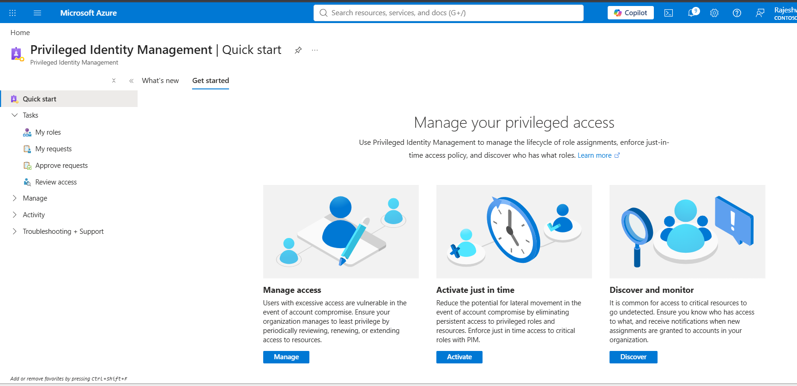

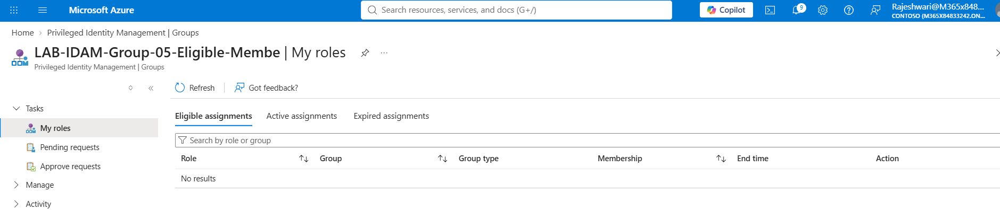

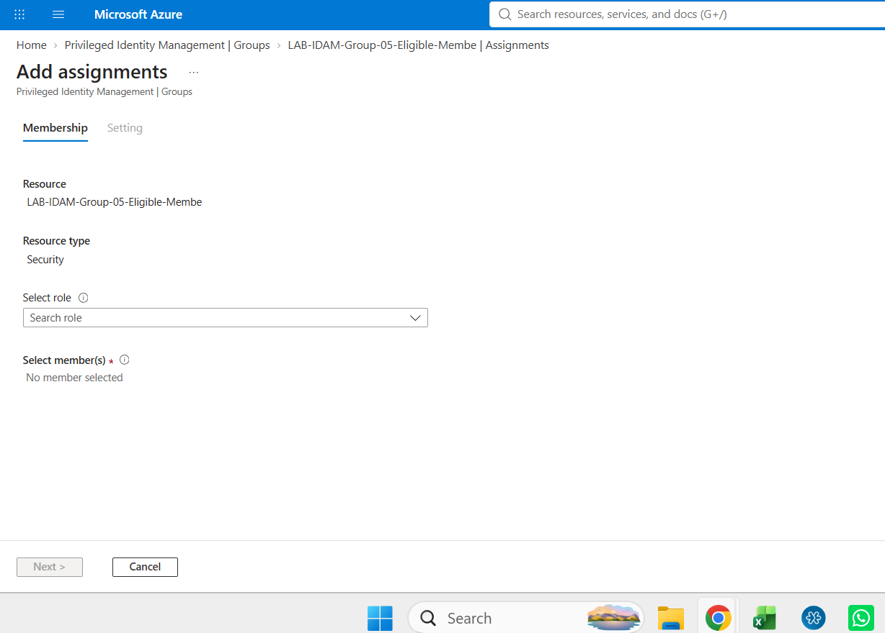

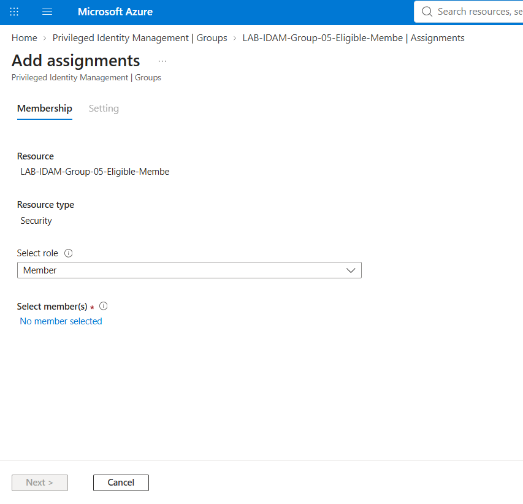

---

## Step 8 – Create and Add Enterprise Applications

Five lab enterprise applications were used:

- `LAB-IDAM-App-01`
- `LAB-IDAM-App-02`
- `LAB-IDAM-App-03`
- `LAB-IDAM-App-04`
- `LAB-IDAM-App-05`

Navigate to:

**Microsoft Entra ID → Enterprise applications**

After creating the applications, navigate to:

**Identity Governance → Access packages → AP-IDAM-Team-Access → Resource roles**

Select:

**Add resource roles → Applications**

Add all five applications.

Assign the application role:

**User**

### Application Evidence

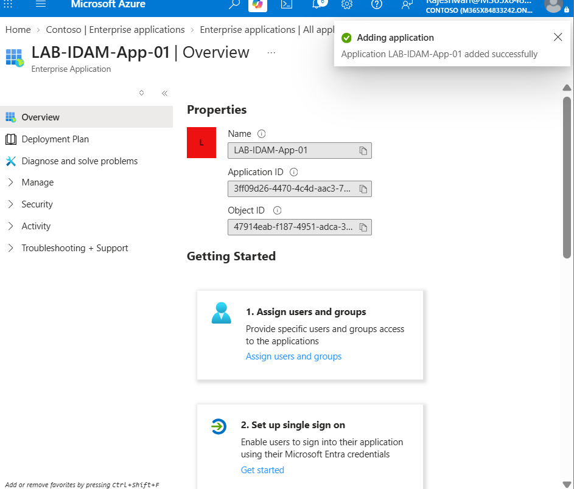

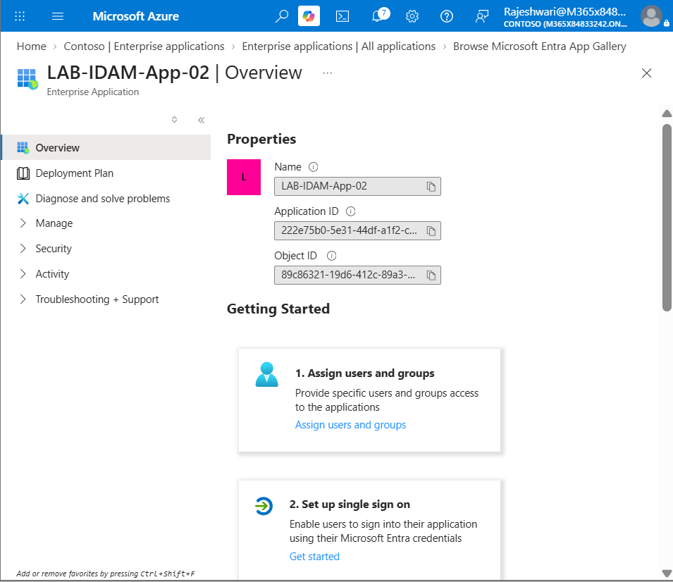

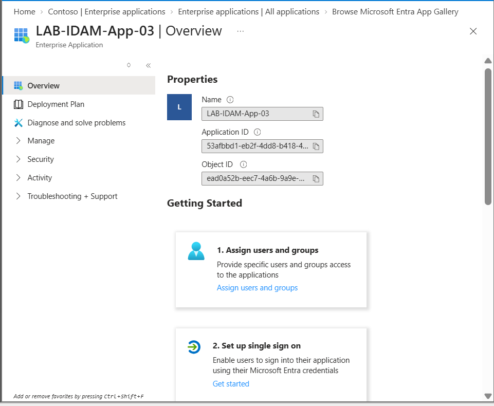

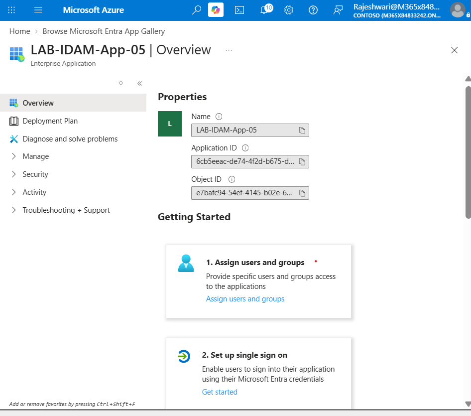


---

## Step 9 – Create and Add SharePoint Resources

Three SharePoint sites were created:

- `LAB-IDAM-SP-01`
- `LAB-IDAM-SP-02`
- `LAB-IDAM-SP-03`

The sites represent three different access levels:

| SharePoint Resource | Permission |
|---|---|
| LAB-IDAM-SP-01 | Owners |
| LAB-IDAM-SP-02 | Members |
| LAB-IDAM-SP-03 | Visitors |

Navigate to:

**Identity Governance → Access packages → AP-IDAM-Team-Access → Resource roles**

Select:

**Add resource roles → SharePoint sites**

Add the required SharePoint resources and corresponding roles.

### SharePoint Evidence

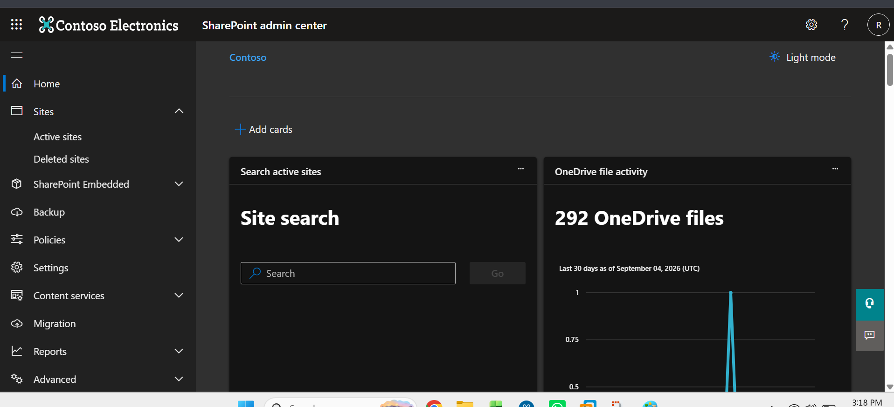

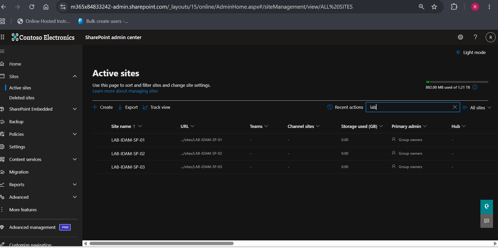

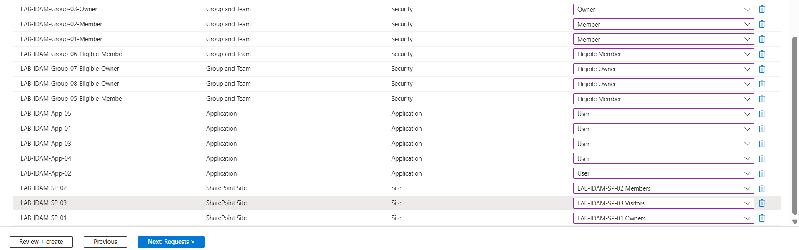


---

# Access Request & Approval Policy

## Step 10 – Create IDAM Requestor Group

To prevent all tenant users from requesting the package, a dedicated requestor group was created.

Navigate to:

**Microsoft Entra ID → Groups → New group**

Configure:

**Group name**

`IDAM-Department-Users`

**Group type**

`Security`

**Membership type**

`Assigned`

Add the test user:

`Rajeswary_test1`

This group represents authorized internal users belonging to the IDAM department.

### Requestor Group Evidence


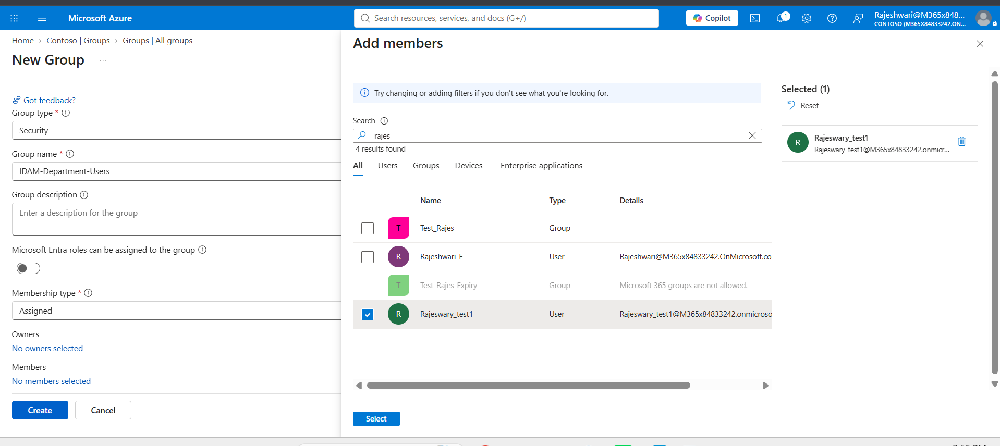

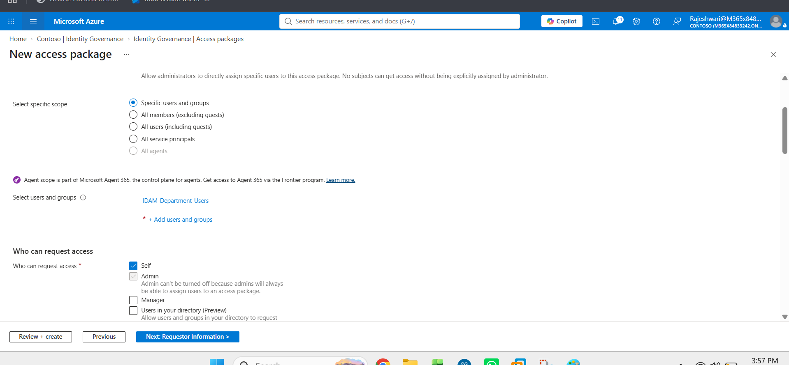

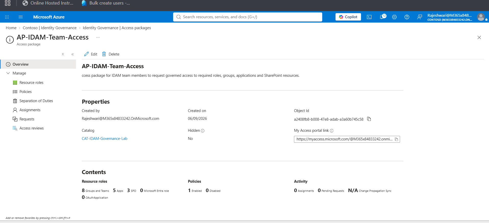

---

## Step 11 – Restrict Access Package Requestors

Navigate to:

**Identity Governance → Access packages → AP-IDAM-Team-Access → Policies**

Configure requestor scope as:

**Specific users and groups**

Select:

`IDAM-Department-Users`

Under who can request access:

**Self → Enabled**

This limits self-service access requests to authorized members of the IDAM requestor group.

### Request Scope Evidence


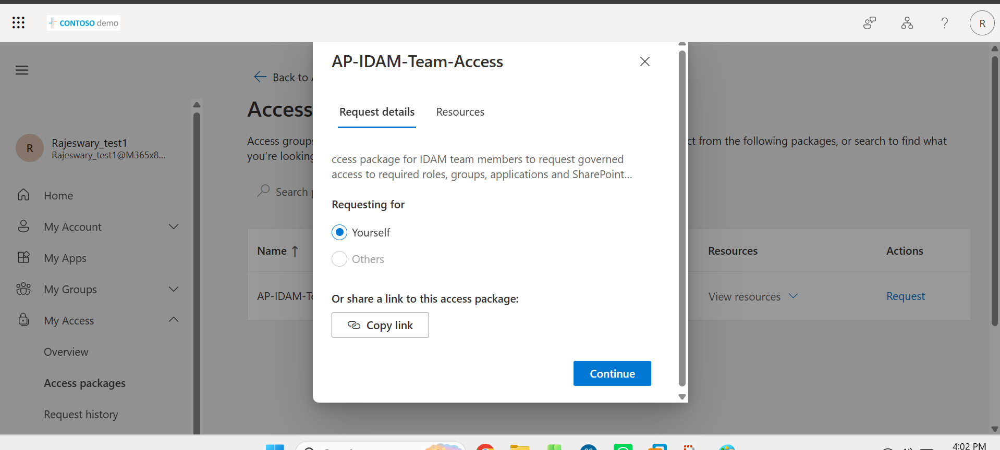

---

## Step 12 – Configure First-Level Approval

Approval was enabled for the access package.

Configure:

**Require approval → Yes**

First approval stage:

**Approver**

`Rajeswari-E`

Configure:

**Decision must be made in**

`4 days`

Enable:

**Require approver justification → Yes**

Enable:

**Forward to alternate approver if no action → Yes**

Configure alternate approver:

`Dileep`

Configure forwarding after:

`3 days`

This prevents the request from remaining unattended if the primary approver is unavailable.

### First-Level Approval Evidence

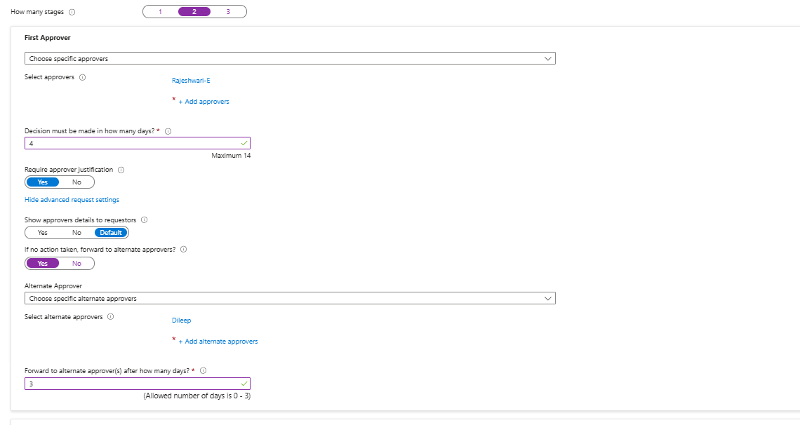

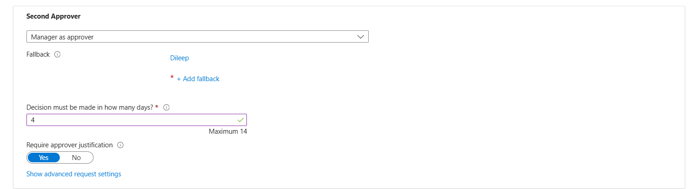


---

## Step 13 – Configure Second-Level Approval

A second approval stage was configured.

Second approver:

**Manager as approver**

Configure:

**Decision must be made in**

`4 days`

Enable:

**Require approver justification → Yes**

Fallback/alternate approver:

`Dileep`

The intended approval flow is:

**User Request → First-Level Approver → Manager**

If the relevant approver is unavailable or cannot act according to the configured workflow, Dileep provides the alternate/fallback approval path.

### Second-Level Approval Evidence

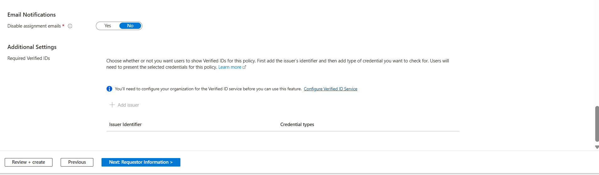


---

## Step 14 – Configure Access Lifecycle

Configure:

**Access package assignments expire**

`Number of days`

Set duration:

`45 days`

Configure:

**Users can request specific timeline**

`No`

Configure:

**Allow users to extend access**

`Yes`

Configure:

**Require approval to grant extension**

`No`

Access Reviews were not enabled for this lab.

This creates a fixed 45-day entitlement lifecycle while allowing users to request an extension without another approval workflow.

### Lifecycle Evidence


---

## Step 15 – Review and Create the Policy

The final policy was reviewed before creation.

Configuration included:

- Requestor scope: `IDAM-Department-Users`
- Self-service request: Enabled
- Two-stage approval: Enabled
- First-level approver: Configured
- Manager approval: Configured
- Alternate/fallback approver: Dileep
- Approval decision deadline: 4 days
- Assignment duration: 45 days
- Extension: Allowed
- Extension approval: Not required

### Policy Evidence

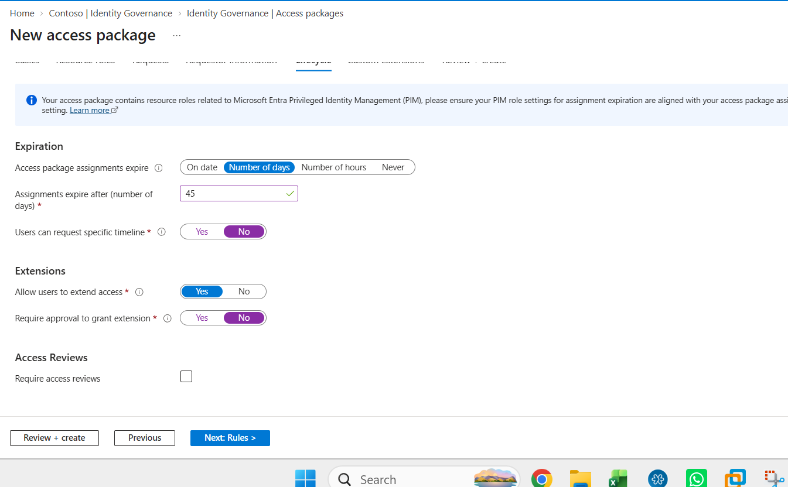


---

## Step 16 – Verify Final Access Package

The completed access package was reviewed.

Final implemented contents:

- **8 Groups and Teams**
- **5 Enterprise Applications**
- **3 SharePoint resources**
- **1 Enabled policy**

The Microsoft Entra administrative role resources remained unavailable because of the documented lab tenant/Preview limitation.

### Final Configuration Evidence

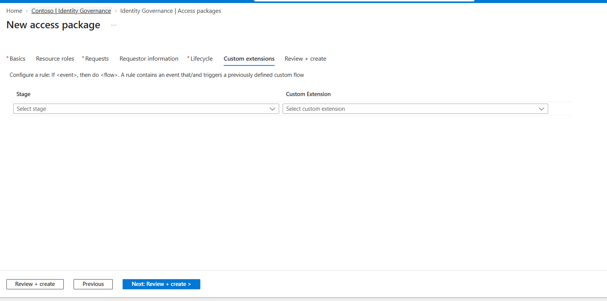


---

# End-to-End Testing

## Step 17 – Sign In to Microsoft My Access

A separate test-user session was used.

Test account:

`Rajeswary_test1`

The user accessed **Microsoft My Access** and located:

`AP-IDAM-Team-Access`

The visibility of the package to the authorized test user validates the configured requestor scope.

### Test Evidence


---

## Step 18 – Submit Access Request

The test user selected:

`AP-IDAM-Team-Access`

The request was submitted for:

**Yourself**

A business justification was entered.

The request was then submitted through My Access.

### Request Evidence


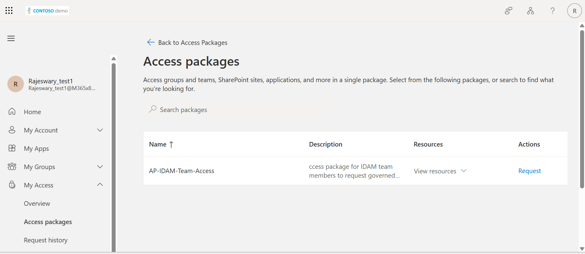

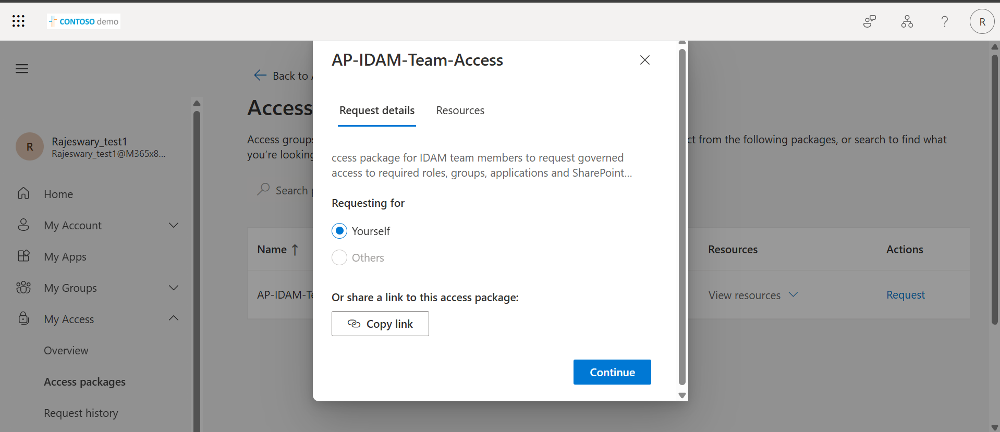
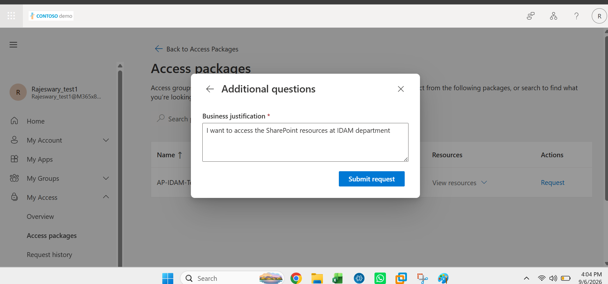
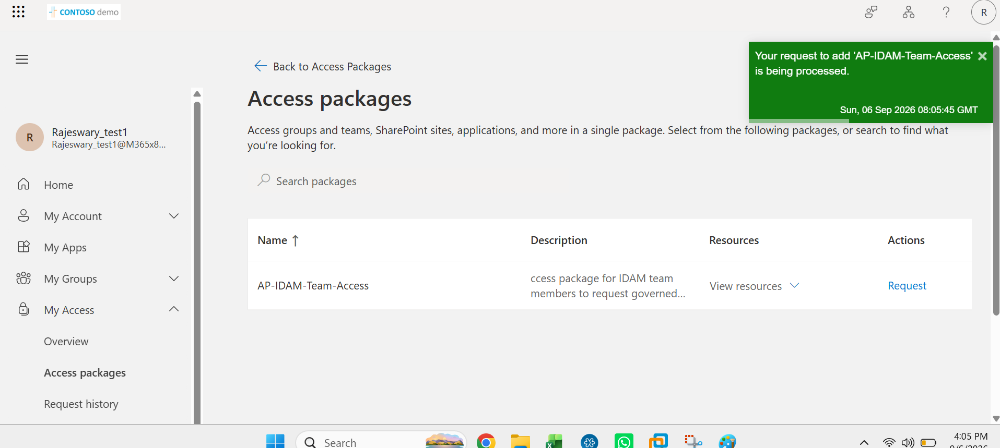

---

## Step 19 – Verify Pending Approval

Navigate to:

**My Access → Request history**

The submitted request entered:

**Pending approval**

This confirms that the package did not immediately provision access and that the configured governance approval workflow was triggered.

### Pending Approval Evidence

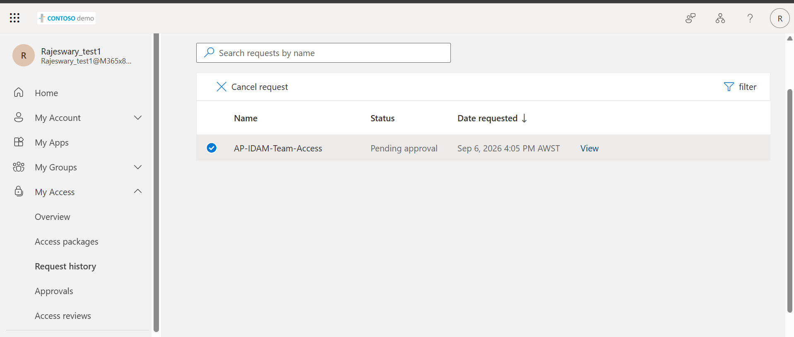


---

## Step 20 – Complete First-Level Approval

The designated first-level approver reviewed the request.

Navigate to:

**My Access → Approvals**

Locate the request from:

`Rajeswary_test1`

Requested package:

`AP-IDAM-Team-Access`

The request was approved with justification.

The workflow then proceeded to the next approval stage.

### First Approval Evidence

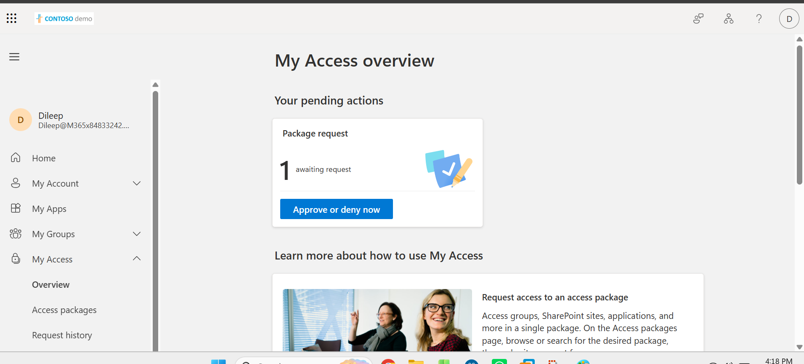

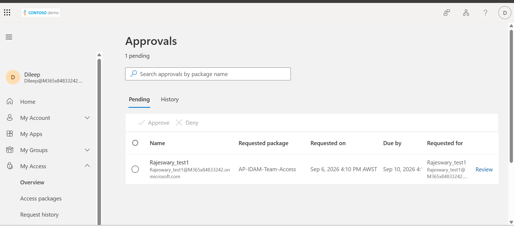

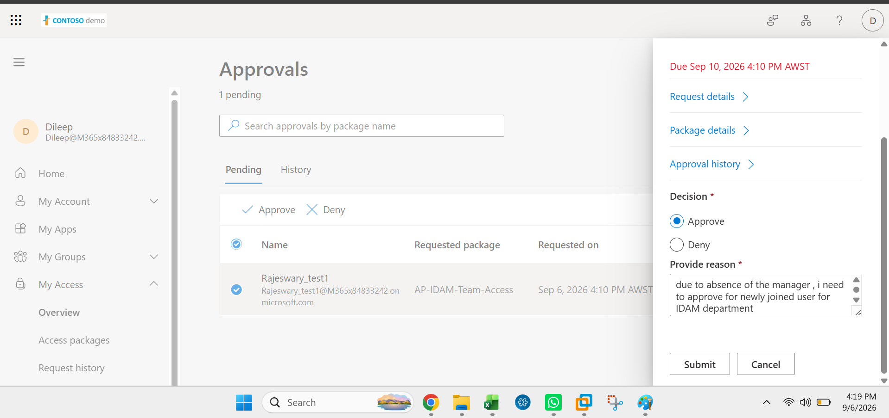

---

## Step 21 – Validate Second/Fallback Approval

The second stage was designed to use:

**Manager as approver**

with:

`Dileep`

configured as the alternate/fallback approver.

During the lab test, the pending approval action became available through the configured Dileep approval path.

Dileep reviewed the request and approved it with justification.

This validated the alternate/fallback approval mechanism.

### Fallback Approval Evidence

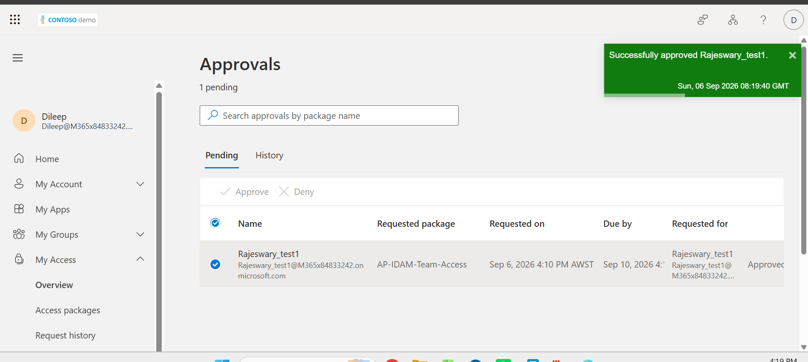

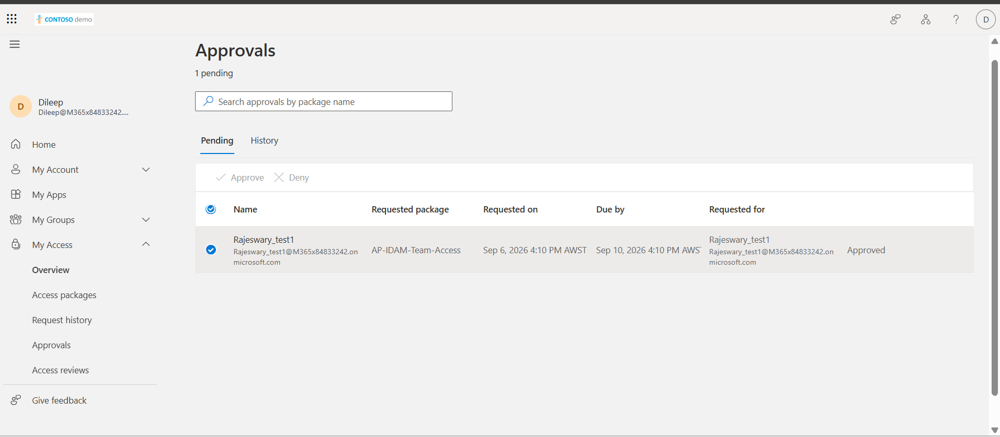

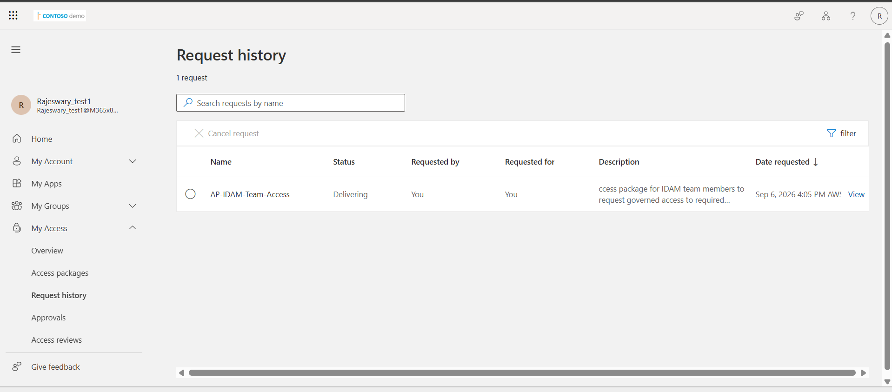

---

## Step 22 – Verify Resource Delivery

After approval, the request progressed to:

**Delivering**

This indicates that the approval workflow completed and Microsoft Entra Entitlement Management began provisioning the package resources.

The final request state was then verified as:

**Delivered**

### Delivery Evidence

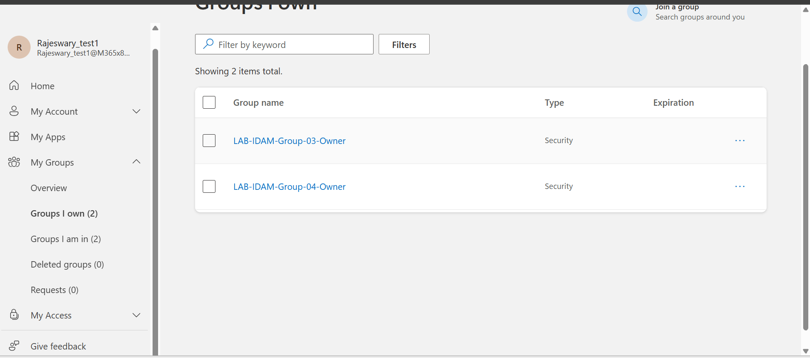

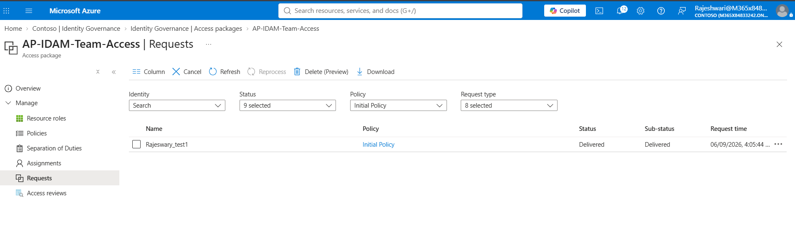


---

## Step 23 – Validate Active Group Membership

Sign in as:

`Rajeswary_test1`

Navigate to:

**My Groups → Groups I am in**

The user received active membership in the required Member groups.

Examples:

- `LAB-IDAM-Group-01-Member`
- `LAB-IDAM-Group-02-Member`

The existing:

`IDAM-Department-Users`

membership remains because this group controls eligibility to request the access package.

### Membership Validation Evidence

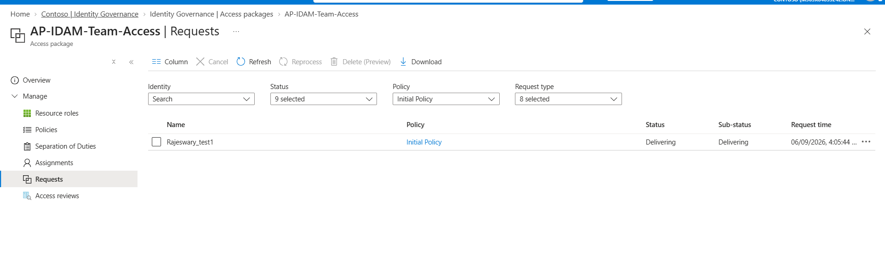

---

## Step 24 – Validate Active Group Ownership

Navigate to:

**My Groups → Groups I own**

Verify the required Owner assignments.

Examples:

- `LAB-IDAM-Group-03-Owner`
- `LAB-IDAM-Group-04-Owner`

This validates that the access package can provision **Owner** resource roles in addition to standard Member access.

### Ownership Validation Evidence


---

## Step 25 – Validate PIM Eligible Access

Navigate to:

**Identity Governance → Privileged Identity Management → Groups**

Open the relevant eligible group and navigate to:

**Assignments → Eligible assignments**

The test user:

`Rajeswary_test1`

was verified as an **Eligible** assignee.

This demonstrates an important distinction:

> The access package grants eligibility for the privileged group role. The eligible user does not automatically receive permanently active privileged access.

The user can activate the eligible access through PIM when required.

### PIM Validation Evidence

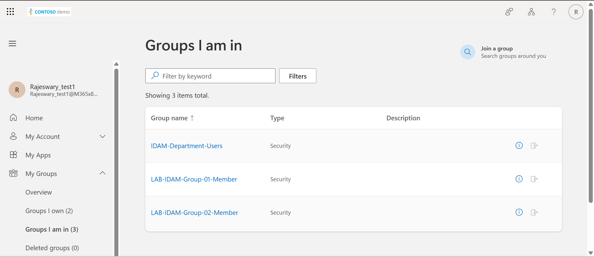

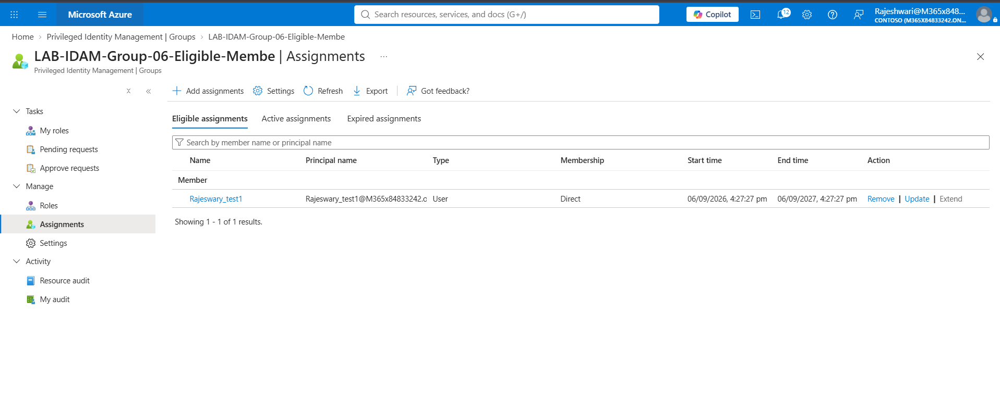

---

# Validation Results

| Control | Result |
|---|---|
| Dedicated governance catalog | Successful |
| Access package creation | Successful |
| IDAM-only request scope | Successful |
| 2 Active Member groups | Successful |
| 2 Active Owner groups | Successful |
| 2 Eligible Member groups | Successful |
| 2 Eligible Owner groups | Successful |
| PIM eligible assignment | Successful |
| 5 enterprise applications | Configured |
| 3 SharePoint resources | Configured |
| Stage 1 approval | Successful |
| Stage 2/fallback workflow | Successful |
| Dileep fallback approval path | Successful |
| 4-day approval deadline | Configured |
| 45-day assignment lifecycle | Configured |
| User extension | Enabled |
| Extension approval | Not required |
| Resource delivery | Delivered |
| Entra administrative roles | Lab tenant/Preview limitation |

---

# Troubleshooting & Lab Limitation

## Microsoft Entra Role Resource – No Resource Found

The intended business solution included:

- Intune Administrator
- Helpdesk Administrator

The access package interface provided:

**Microsoft Entra role (Preview)**

However, searches for the required administrative roles returned:

**No resource found**

The issue remained after validating the administrative permissions and Catalog Owner assignment.

Because these resources could not be surfaced by the shared lab tenant, they were **not represented as successfully implemented**.

The intended production design would include these administrative roles where the required tenant capability, licensing, permissions, and Preview feature availability support the configuration.

The unsuccessful configuration attempt was retained as troubleshooting evidence because identifying and documenting environmental limitations is also an important part of identity administration.

---

# Final Architecture

The implemented governance workflow can be summarized as:

```text
IDAM Department User
        |
        v
Microsoft My Access
        |
        v
AP-IDAM-Team-Access
        |
        v
Stage 1 - First-Level Approver
        |
        v
Stage 2 - Manager / Fallback Approval
        |
        v
Microsoft Entra Entitlement Management
        |
        v
Automated Entitlement Provisioning
        |
        +-------------------------------+
        |               |               |
        v               v               v
     Groups       Applications      SharePoint
        |
        v
Active + PIM Eligible Access
        |
        v
45-Day Time-Bound Assignment
        |
        v
Extension Available
```

---

# Security & Governance Benefits

## Least Privilege

Privileged group access is provided as **Eligible Member/Owner** where appropriate instead of permanently active privileged access.

## Standardized Onboarding

Users performing the same IDAM job function can receive a consistent set of entitlements from one access package.

## Approval Governance

Access is not automatically granted when requested. The request must progress through the configured approval workflow.

## Restricted Request Scope

Only authorized users represented by the `IDAM-Department-Users` group can self-request the package.

## Resilient Approval Workflow

Alternate/fallback approval reduces the risk of an onboarding request remaining blocked when the primary approver cannot act.

## Time-Bound Access

The entitlement has a defined **45-day lifecycle** rather than remaining assigned indefinitely.

## Self-Service Access

Authorized users can request the package through Microsoft My Access rather than relying entirely on administrators for manual provisioning.

## Reduced Administrative Effort

Without an access package, an administrator would need to repeatedly provision multiple groups, applications, SharePoint permissions, and privileged access for each new employee.

The access package centralizes these entitlements into a governed onboarding workflow.

---

# Key Learning Outcomes

This project provided hands-on experience with:

- Microsoft Entra Entitlement Management
- Identity Governance catalogs
- Access package design
- Resource role assignment
- Requestor scoping
- Multi-stage approvals
- Manager-based approval
- Alternate/fallback approvers
- PIM for Groups
- Eligible Member access
- Eligible Owner access
- Active Member access
- Active Owner access
- Enterprise application assignment
- SharePoint resource roles
- Time-bound entitlement management
- Assignment lifecycle controls
- Access extension
- Microsoft My Access
- End-to-end request testing
- Access delivery validation
- Identity Governance troubleshooting

---

# Project Result

The project successfully demonstrated an end-to-end **Microsoft Entra Identity Governance onboarding workflow**.

An authorized IDAM user was able to:

1. Discover the access package through Microsoft My Access.
2. Submit an access request.
3. Enter a controlled multi-stage approval process.
4. Pass first-level approval.
5. Progress through the configured fallback approval path.
6. Reach the entitlement delivery stage.
7. Receive active group membership.
8. Receive active group ownership.
9. Receive PIM eligible group access.
10. Reach the final **Delivered** request state.

Although one test user was used for end-to-end validation, the same access package design represents the business requirement for onboarding **20 new IDAM team members** with a standardized set of entitlements.

This approach reduces repetitive manual provisioning while improving **governance, consistency, least privilege, approval control, and access lifecycle management**.

---

# Screenshot Evidence

The complete project contains **80 screenshots** documenting the configuration, troubleshooting, approval workflow, resource delivery, and access validation.

Screenshots are stored under:

`/screenshots`

Naming structure:

```text
part-1-01.png ... part-1-20.png
part-2-01.png ... part-2-20.png
part-3-01.png ... part-3-20.png
part-4-01.png ... part-4-20.png
```

---

# Skills Demonstrated

`Microsoft Entra ID`  
`Identity Governance`  
`Entitlement Management`  
`Access Packages`  
`Privileged Identity Management (PIM)`  
`PIM for Groups`  
`IAM`  
`RBAC`  
`Microsoft 365`  
`SharePoint Online`  
`Enterprise Applications`  
`Access Lifecycle Management`  
`Least Privilege`  
`Multi-Stage Approval`  
`Identity Governance Troubleshooting`
